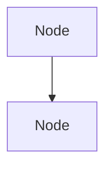

Mermaid diagrams are available in MDX blog posts as fenced code blocks with the `mermaid` language identifier:

````

````

**How it works:** Handled automatically by `src/mdx-components.tsx` — no component import is needed in the MDX file. Renders client-side with the blog's Matrix theme.

**Supported diagram types:** Flowcharts (`graph TD`/`graph LR`), sequence diagrams, class diagrams, state diagrams, and all other standard Mermaid diagram types.

**How to apply:** When writing technical articles that describe architectures, pipelines, flows, or state machines, consider using a Mermaid diagram instead of (or alongside) bullet lists. First used in the LLM guardrails article (2026-04-26) to visualize the three-layer guardrail pipeline.
