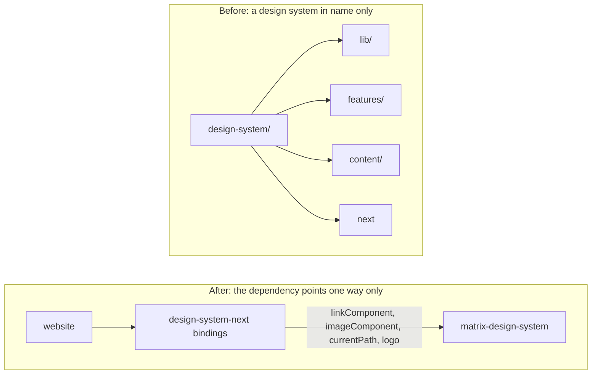
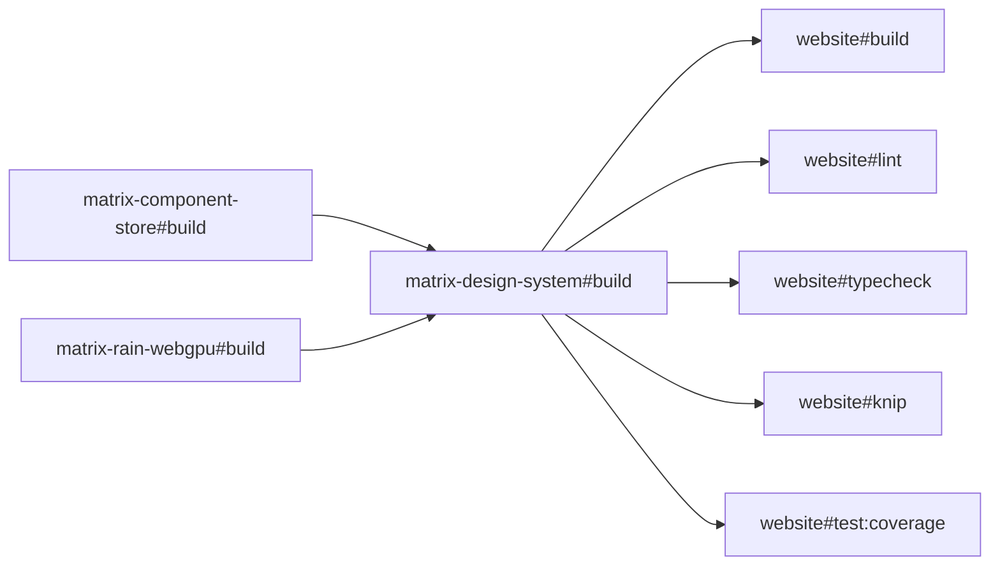
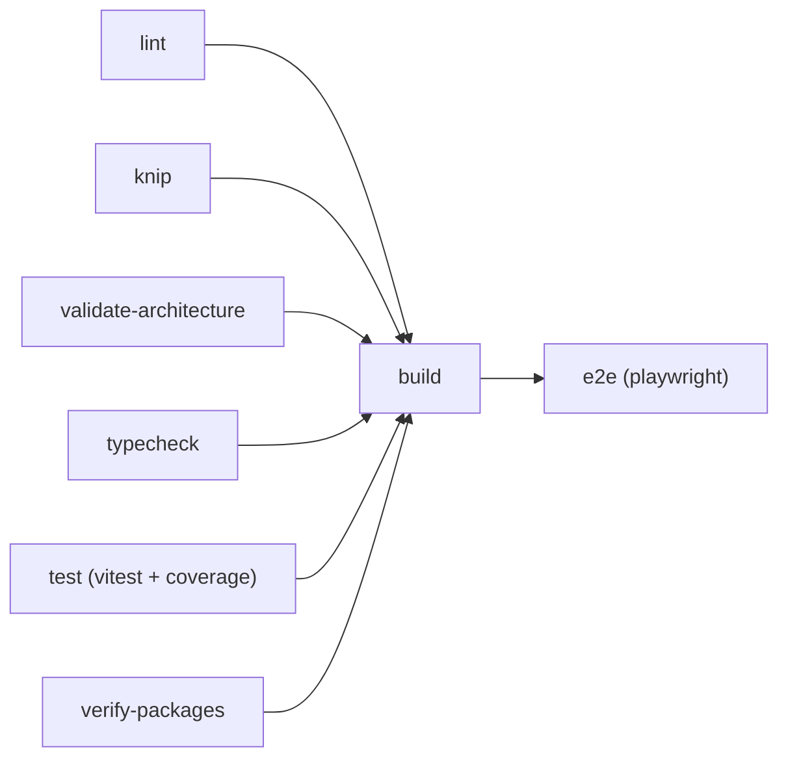

*How I turned my Next.js blog into an npm workspaces and Turborepo monorepo with seven workspaces, extracted a design
system, a component store contract and a WebGPU matrix rain effect, and published three packages on npm with OIDC
trusted publishing.*

---

The blog you're reading is a Next.js app. For years that's all it was: one repository, one `package.json`, one
`next build`. Then, slowly, it grew a few things that were not really "the website".
It grew a Matrix inspired design system (atoms, molecules, and organisms, a few hundred files of it).
It grew a component store contract that every single component in the codebase follows.
It grew an ESLint plugin whose only job is to enforce that contract.
And it grew a WebGPU matrix rain effect that paints the animated background you can see behind this text.

That last one didn't even live here. It had its own repository, its own CI, its own release workflow, and its own
dependency stream. Anything shared between the two (React, TypeScript, the types packages) moved as two separate
updates in two separate places, with no guarantee at all that they landed together.

The other three had the opposite problem: they had no boundary whatsoever. The design system was a design system by
folder name only. It imported from `lib/`, it imported from `features/`, it imported from `content/`, and it imported
from `next`. You could not have lifted it out of the app with anything short of a rewrite, which means it also could
not be published, showcased, or reused. A reusable library that cannot leave the building is just a folder with
ambitions.

So I turned the whole thing into a monorepo: npm workspaces plus Turborepo, seven workspaces (three apps and four
packages), three of which are now published on npm. This post is the playbook. It follows the real chronology, five
acts and the pipeline they all converge on, with the gotchas landed exactly where they bit me, because a few of them
cost me a lot more time than they should have.

One note on how this got done, and then I'll never mention it again. The whole migration ran through the agentic SDLC
pipeline I described in
[the post about our software engineer skills pyramid](/blog/post/2026/07/10/software-engineer-skills-pyramid-harness-sdlc):
explore, plan, implement and review in a bounded loop, then a pull request. That's the only reason a side project
produced around 27 tightly scoped pull requests instead of one enormous "monorepo" commit that nobody (including
future me) could ever review. Small PRs are a discipline, and having a harness makes the discipline cheap.

Let's start.

## The stack, and why

Five tools do all the work here:

- **npm workspaces** for the workspace graph, hoisting, and a single lockfile
- **Turborepo** for the task graph, the caching, and the ordering between workspaces
- **tsdown** to build the packages (ESM output plus type declarations)
- **release-it** with `@release-it/conventional-changelog` to cut releases and changelogs
- **npm OIDC trusted publishing** to publish without any long lived token

I want to be honest about how these were chosen, because monorepo posts love to present a tooling decision as the
output of a benchmark. There was no benchmark. Every one of these was picked for continuity with what the repository
already did:

- I was already publishing to npm, and npm is already the package manager here, so npm workspaces cost exactly zero
  migration
- I was already using release-it with conventional changelog for the site's own releases
- Turborepo is first party on Vercel, which is where the site deploys

I did not run a pnpm, Yarn, or Nx bake off, so I'm not going to pretend I have data comparing them. What I do have is
a specific reason for one choice that usually goes the other way: **release-it per package rather than Changesets**.
Changesets is the default answer for publishing from a monorepo and it's a good tool, but adopting it would have meant
running two release paradigms side by side in one repository, one for the site and one for the packages. Giving each
package its own `.release-it.json` keeps a single mental model: same tool, same conventional commits, same changelog
generator, just scoped differently. Fewer concepts beat better concepts when you're the only maintainer.

## Act 0: decouple before you move

Here's the single most useful thing I learned, and it happened before the monorepo existed at all.

Three pull requests (#534, #535, and #536) landed while the repository was still one plain Next.js app. None of them
created a workspace. None of them moved a file into `packages/`. All they did was sever the design system from
everything around it:

- **#534** made it independent of the website: no imports from `lib/`, from `features/`, or from `content/`
- **#535** made it framework agnostic: no imports from `next` at all
- **#536** gave it its own stylesheet, instead of borrowing the app's global CSS



The interesting half is #535, because "remove the `next` import" sounds trivial until you notice that a design system
is mostly links and images, and both of those are Next components. The fix is dependency injection at the component
level. The design system declares the *shape* of a link it needs, and ships a framework free default:

```tsx
export interface LinkComponentProps extends Omit<AnchorHTMLAttributes<HTMLAnchorElement>, "href"> {
    href: string;
    children?: ReactNode;
    prefetch?: PrefetchStrategy;
}

/**
 * What the design system needs from a link renderer. Consumers inject a router-aware implementation
 * (`next/link`, a framework `<Link>`, and so on); without one, links fall back to {@link AnchorLink}.
 */
export type LinkComponent = FC<LinkComponentProps>;

/**
 * The framework-free default: a real `<a>`, which navigates correctly everywhere but without
 * client-side routing.
 */
export const AnchorLink: LinkComponent = ({ href, children, prefetch: _prefetch, ...rest }) => (
    <a href={href} {...rest}>
        {children}
    </a>
);
```

Every component that renders a link then takes that implementation as an optional prop, and falls back to the plain
anchor when nobody injects anything:

```tsx
export interface InternalLinkProps {
    to: string;
    className?: string;
    children?: ReactNode;
    prefetch?: PrefetchStrategy;
    onClick?: () => void;
    linkComponent?: LinkComponent;
}

export const InternalLink: FC<InternalLinkProps> = ({
    children,
    className,
    to,
    onClick,
    prefetch = "viewport",
    linkComponent: Link = AnchorLink,
}) => (
    <Link className={className} href={to} prefetch={prefetch} onClick={onClick}>
        {children}
    </Link>
);
```

The Next specific half doesn't disappear, it just moves up a layer. It now lives in the website, in a folder called
`design-system-next`, which is deliberately *not* a package: the goal was a framework agnostic design system, not a
shared bundle of Next glue.

```tsx
export const InternalLink: FC<Omit<InternalLinkProps, "linkComponent">> = (props) => (
    <DesignSystemInternalLink {...props} linkComponent={NextLink} />
);
```

Same story for images (`imageComponent`), for the active route (`currentPath` arrives as a prop instead of the design
system calling `usePathname()`), and for site assets like the logo. Note the prefetch strategy in those props, by the
way: the design system says *when* to prefetch (`viewport`, `hover`, or `never`), and the injected implementation
decides *how*, which is exactly the split you want between a library and its host.

And because a rule that only lives in your head is not a rule, the constraint is machine enforced. Today it lives in
the package's own dependency-cruiser config, at error level, and it fails CI the moment anyone reintroduces the import:

```javascript
{
    name: "no-next",
    comment:
        "The design system is framework-agnostic: it must not import from next. A consumer injects its own link and image implementations (see AnchorLink / PlainImage).",
    severity: "error",
    from: {},
    to: { path: "node_modules/next/" },
},
```

Here's what Act 0 bought me, and it's the reason I'd do it in this order again: by the time I actually created the
workspaces, the extraction was a `git mv`. Not a rewrite, not a refactor with the build broken for three days. The
hard work (finding and cutting every coupling) happened while the code was still in one place, still fully tested, and
still shippable at every commit. Decouple first, move second. If you're staring at a monorepo migration and the
boundaries don't exist yet, the boundaries are the project. The folder move is an afternoon.

## Act 1: seven workspaces

PR #537 is the one that turned the repository into a monorepo. The final layout, three apps and four packages:

```shell
package.json                          workspace root: workspaces, turbo, husky, release-it, prettier
turbo.json                            the task graph (build, lint, typecheck, test, e2e)
apps/
  website/                            the Next.js site (this blog)
  matrix-design-system-showcase/      Storybook over the design system's stories
  matrix-rain-showcase/               Astro + Starlight docs for the rain effect
packages/
  matrix-design-system/               published: the React design system
  matrix-component-store/             published: the ComponentStore/StateStore/EffectsStore contract
  matrix-rain-webgpu/                 published: the WebGPU matrix rain effect
  eslint-plugin-chicio/               private: the component-store lint rules
```

The split between the two folders is a rule, not a taste: **`packages/` publishes, `apps/` deploys**. Anything that
ships to npm is a package. Anything that ships to a URL is an app. That one sentence answers most "where does this go"
questions before they turn into a discussion.

The root `package.json` is small on purpose. It declares the workspaces, the shared tooling, and nothing that belongs
to a single workspace:

```json
{
  "name": "chicio-blog",
  "version": "4.0.0",
  "private": true,
  "workspaces": [
    "apps/*",
    "packages/*"
  ],
  "engines": {
    "node": "24.x"
  },
  "devEngines": {
    "runtime": { "name": "node", "version": "^24.0.0", "onFail": "warn" },
    "packageManager": { "name": "npm", "version": "^11.0.0", "onFail": "warn" }
  },
  "scripts": {
    "dev": "turbo run dev",
    "build": "turbo run build",
    "start": "npm run start --workspace=website",
    "lint": "turbo run lint",
    "knip": "turbo run knip",
    "typecheck": "turbo run typecheck",
    "validate-architecture": "turbo run validate-architecture",
    "verify-packages": "node scripts/verify-packages.mjs",
    "test": "turbo run test",
    "test:run": "turbo run test:run",
    "test:coverage": "turbo run test:coverage",
    "test:e2e": "turbo run test:e2e",
    "test:e2e:ui": "npm run test:e2e:ui --workspace=website",
    "chat-knowledge-upload": "npm run chat-knowledge-upload --workspace=website",
    "format": "prettier --write .",
    "format:check": "prettier --check .",
    "release": "release-it",
    "prepare": "husky"
  },
  "devDependencies": {
    "@release-it/conventional-changelog": "^12.0.0",
    "@types/react": "19.2.18",
    "@types/react-dom": "19.2.7",
    "framer-motion": "^13.1.1",
    "husky": "^9.1.7",
    "prettier": "^3.9.6",
    "react": "19.2.8",
    "react-dom": "19.2.8",
    "release-it": "^21.0.2",
    "turbo": "^2.5.6",
    "typescript": "^6.0.3"
  },
  "overrides": {
    "@types/react": "$@types/react",
    "@types/react-dom": "$@types/react-dom",
    "framer-motion": "$framer-motion",
    "react": "$react",
    "react-dom": "$react-dom"
  },
  "allowScripts": {
    "agent-browser@0.33.2": true,
    "esbuild@0.28.2": true,
    "fsevents@2.3.2": true,
    "fsevents@2.3.3": true,
    "protobufjs@7.6.5": true,
    "unrs-resolver@1.11.1": true
  }
}
```

`npm run <task>` at the root delegates to `turbo run <task>` across every workspace. To run something in one place
only, `npm run <task> --workspace=website`. And yes, `devEngines.packageManager` declares a same major range
(`^11.0.0`) rather than something wider: Turborepo requires a package manager to be declared and rejects a range that
spans majors.

### The npm gotchas

That `overrides` block looks innocent. It is not, and getting it wrong costs you a duplicated React in your bundle,
which then fails the typecheck in ways that look like anything except a duplicated React. I ended up measuring the
behaviour in scratch workspaces on npm 11.19.0, using a real conflict, and here is what actually happens:

- no override at all: **2 copies**
- override in the **root** `package.json` using the `$name` form, and the root also declares the package: **1 copy**
- override in a **workspace** `package.json`: **2 copies**, npm silently ignores it
- override in the root with `$name`, but the root does **not** declare the package: **2 copies**, the `$` silently
  does nothing
- override in the root with a literal range, alongside a root declaration: rejected outright,
  `npm error code EOVERRIDE`

So a shared pin needs **both** a root declaration and the `$name` form. That's why `react` and `framer-motion` sit in
the root `devDependencies` even though the root itself renders nothing: they're there so the override has something to
point at. The `$name` syntax exists precisely because the literal range version is a hard error.

Three more npm facts worth knowing before they surprise you:

- `allowScripts` is root only too. Put it in a workspace and npm prints `allowScripts in workspace … is ignored` and
  carries on happily
- the root `.npmrc` here sets `legacy-peer-deps = true`, so peer ranges are **never enforced**, not on `npm install`
  and not on the `npm ci` in every CI job. Never rely on a peer range to catch a bad version in a repo configured this
  way, because it won't
- `npm:` aliases collapse onto the real package when something else peer depends on the real name. I measured this
  while trying to pin two TypeScript majors: the manifest records the alias, `npm explain` reports the real package,
  and `node_modules/typescript` holds the real one. An alias is not a way to hide a dependency or to pin a second
  major under a different name

### The Turborepo gotchas

The root `turbo.json` is the task graph:

```json
{
    "$schema": "https://turborepo.com/schema.json",
    "ui": "stream",
    "globalDependencies": [".prettierrc"],
    "globalEnv": ["CI", "NODE_ENV"],
    "tasks": {
        "build": {
            "dependsOn": ["^build"],
            "outputs": [".next/**", "!.next/cache/**", "dist/**"]
        },
        "dev": { "dependsOn": ["^build"], "cache": false, "persistent": true },
        "start": { "dependsOn": ["^build"], "cache": false, "persistent": true },
        "lint": { "dependsOn": ["^build"] },
        "knip": { "dependsOn": ["^build"] },
        "typecheck": { "dependsOn": ["^build"] },
        "validate-architecture": {},
        "test": { "dependsOn": ["^build"], "cache": false, "persistent": true },
        "test:run": { "dependsOn": ["^build"] },
        "test:coverage": { "dependsOn": ["^build"], "outputs": ["coverage/**"] },
        "test:e2e": { "dependsOn": ["build"], "outputs": ["playwright-report/**"] }
    }
}
```

Notice `dependsOn: ["^build"]` on nearly everything, including `lint` and `typecheck`. The caret means "the `build`
task of every workspace I depend on". It's there because the website depends on the packages **by version**
(`"matrix-design-system": "^1.0.0"`), npm resolves that to the workspace copy, and the workspace copy is consumed
through its built `dist/`, not through its source. Without `^build`, a fresh checkout typechecks the website against
types that don't exist yet.



That same `dist/` indirection would make development miserable (edit a package, rebuild it by hand, reload) if
`npm run dev` didn't also start each package's `tsdown --watch`. Because `dev` declares `dependsOn: ["^build"]` and
each package has its own `dev` script, a change under `packages/` reaches the running Next dev server on its own.

The second gotcha is environment variables, and this one is subtle enough that I want to quote the config. Turborepo
requires every variable a task reads to be declared, and **an undeclared variable is silently stripped rather than
erroring**. The site's secrets therefore live in `apps/website/turbo.json`, on the tasks that actually run the app:

```json
{
    "$schema": "https://turborepo.com/schema.json",
    "extends": ["//"],
    // Only this app reads these, so they belong here rather than in the root globalEnv, where
    // every variable is a cache key for every task in every workspace: changing GROQ_API_KEY
    // there invalidates the design system's build, which cannot possibly use it.
    //
    // Listed only on the tasks that actually run this app's code. Turborepo's strict env mode
    // filters the environment it hands a task, so a variable missing here is silently undefined
    // rather than an error — and /blog/stats is prerendered, which means the Google Analytics
    // ones are read during `next build`, not only at request time.
    "tasks": {
        "build": {
            "outputs": [
                ".next/**",
                "!.next/cache/**",
                "public/sw*",
                "public/media/content/**"
            ],
            "env": [
                "CONTACT_EMAIL",
                "GOOGLE_ANALYTICS_API_SECRET",
                "GOOGLE_ANALYTICS_PROPERTY_ID",
                "GOOGLE_ANALYTICS_SA_CLIENT_EMAIL",
                "GOOGLE_ANALYTICS_SA_PRIVATE_KEY",
                "GROQ_API_KEY",
                "RESEND_API_KEY",
                "UPSTASH_REDIS_REST_TOKEN",
                "UPSTASH_REDIS_REST_URL",
                "UPSTASH_VECTOR_REST_TOKEN",
                "UPSTASH_VECTOR_REST_URL"
            ]
        }
        // "dev", "start" and "test:e2e" follow, each declaring the same eleven variables.
    }
}
```

Two things in there are worth your time. First, the reason those variables are not in the root `globalEnv`: every
entry there becomes a cache key for **every task in every workspace**, so rotating `GROQ_API_KEY` would invalidate the
design system's build, which cannot possibly read it. Only `CI` and `NODE_ENV` are global here. Second, the list
cannot be derived by grepping for `process.env.X`. `GROQ_API_KEY` is read implicitly by `@ai-sdk/groq` and never
appears anywhere in my source, and the Google Analytics keys are destructured from an injected `env` object. Treat
your `.env.production` and your hosting dashboard as the authoritative list, not the code.

The `outputs` in that file are also a scar. The website's `prebuild` step writes outside `.next` (it generates the
service worker and mirrors blog post images into `public/media/content`), and a workspace task **replaces** the root's
outputs rather than merging them. Until both were declared, a cache hit restored `.next`, skipped prebuild, and
produced a site with no service worker and no content images. A green build that ships a broken site is the worst
possible failure mode, and cache configuration is very good at producing exactly that.

The last Turborepo gotcha showed up on Vercel. Turbo's `--cache` flag is **run level**, and a task's `cache` key is a
boolean, so there's no way to say "remote off for this task, local on". I needed exactly that: the website's `.next`
output is 427 MB and Vercel's remote cache rejected the upload with a `400` on every deploy, while the three small
package artifacts (883 B, 14 KB, and 75 KB) uploaded fine. The fix is to split the build into two turbo invocations:

```shell
npx turbo run build --filter='website^...' && \
  npx turbo run build --filter=website --cache=local:rw,remote:r
```

The first builds everything the website depends on (with the remote cache fully enabled), the second builds the
website itself with the remote cache read only. A single invocation would either keep failing the upload or stop the
package artifacts from being cached at all.

What Act 1 bought: **one lockfile, one install, one CI run**.

## Act 2: extract and publish

PRs #538 through #546 did the actual extraction and put the result on npm. This is where "monorepo" stops being a
folder layout and starts being a distribution decision.

The package surface is the part I'd tell anyone to think about first. The design system's root barrel must stay
cheap to import, but some components genuinely need heavy libraries: charts need `recharts`, the markdown renderer
needs the whole unified and remark stack, and the command palette needs `cmdk`. If those sit in the root barrel, then
`import { Button } from "matrix-design-system"` fails to resolve for every consumer who didn't install all of them.
So they live behind their own entry points, and everything heavy is an **optional** peer dependency:

```json
{
  "exports": {
    ".": {
      "types": "./dist/index.d.mts",
      "default": "./dist/index.mjs"
    },
    "./chart": { "types": "./dist/chart.d.mts", "default": "./dist/chart.mjs" },
    "./markdown": { "types": "./dist/markdown.d.mts", "default": "./dist/markdown.mjs" },
    "./command-palette": {
      "types": "./dist/command-palette.d.mts",
      "default": "./dist/command-palette.mjs"
    },
    "./styles.css": "./src/styles/index.css",
    "./theme.css": "./src/styles/theme.css",
    "./package.json": "./package.json"
  },
  "files": ["dist", "src/styles"],
  "sideEffects": ["*.css"]
}
```

That property is enforced, not hoped for. A dependency-cruiser rule fails the build if anything reachable from
`src/index.ts` ever touches one of those libraries again, and it counts type only imports too, because a `recharts`
type in the published `.d.mts` breaks a consumer's typecheck just as hard as a runtime import breaks their bundle.

One clause on the React Compiler while we're in the build config: it moved into the package's own tsdown build, and it
runs on `"use client"` modules only. Next skips `node_modules` and confines its compiler loader to the app directory,
so it never sees these sources at all, and compiling a server component crashes the render (the compiled output calls
`c()` from `react/compiler-runtime`, which needs a hooks dispatcher that a server component never has).

### The verification step, and why it exists

This is the piece I'd port to any repository that publishes from a workspace, and the reasoning is worth quoting from
the script's own header, because it's the whole argument:

```javascript
/**
 * Verifies what the registry would actually serve, which a workspace build never can.
 *
 * The website resolves these packages through the workspace, so it exercises the source tree and
 * silently proves nothing about the published artifact. That gap is not theoretical: the design
 * system once shipped a stylesheet whose `@source` glob pointed at `src/**`, which `files` does not
 * publish — every component would have rendered with no colours, spacing or layout, behind a fully
 * green build.
 *
 * So: pack each package, lint the published surface, then install the real tarballs into a throwaway
 * app and import them. The tarballs are installed together, so this works before anything is on npm.
 */
```

That middle paragraph is the trap that makes workspace publishing dangerous. Everything in your repository resolves
the package through the workspace symlink, so everything in your repository tests the **source tree**. Your tests
pass, your build passes, your site renders perfectly, and the tarball you upload is missing a file.

`scripts/verify-packages.mjs` closes that gap by doing what a real consumer does. It builds every package, runs
`npm pack` on each one, lints the published surface with `publint --strict`, checks the type resolution with
`@arethetypeswrong/cli`, then installs the actual tarballs into a throwaway app in a temp directory and imports them.
The most important line in the whole script is the peer list:

```javascript
// What a consumer must always supply. Deliberately excludes every optional peer: the root barrel
// has to resolve with only these, which is the whole reason charts, markdown and the command
// palette live behind their own entry points.
const REQUIRED_PEERS = ["react@^19", "react-dom@^19", "framer-motion@^12"];

// ...

// The property the entry-point split exists to guarantee.
try {
    importProbe("matrix-design-system", ["Button", "Accordion", "Menu"]);
    console.log("  root barrel imports with no optional peer installed");
} catch (error) {
    fail(`root barrel needs an optional peer: ${(error.stderr || error.message).trim().split("\n")[0]}`);
}
```

Excluding the optional peers is deliberate. If the throwaway app installed everything, the probe would pass no matter
how badly the entry point split had regressed. Only afterwards does the script install the optional peers in one go
and probe `/chart`, `/markdown`, and `/command-palette` individually. It also re-reads the `@source` globs from the
**installed** stylesheet and fails if any of them matches zero published files, which is the original bug turned into
a permanent regression test.

### Releasing

Each package owns its own release config. Here's the design system's, in full:

```json
{
    "$schema": "https://unpkg.com/release-it/schema/release-it.json",
    "git": {
        "tagName": "matrix-design-system@${version}",
        "tagMatch": "matrix-design-system@*",
        "tagAnnotation": "matrix-design-system ${version}",
        "commitMessage": "chore(release): :bookmark: matrix-design-system ${version}",
        "commitsPath": ".",
        "requireCommits": true
    },
    "github": {
        "release": true,
        "releaseName": "matrix-design-system ${version}"
    },
    "npm": {
        "publish": true,
        "skipChecks": true
    },
    "hooks": {
        "before:init": "npm run build"
    },
    "plugins": {
        "@release-it/conventional-changelog": {
            "preset": "conventionalcommits",
            "infile": "CHANGELOG.md",
            "tagPrefix": "matrix-design-system@",
            "commitsOpts": { "path": "." },
            "gitRawCommitsOpts": { "path": "." }
        }
    }
}
```

Three details carry all the weight. `tagName` and `tagPrefix` together give per package tags like
`matrix-design-system@1.1.0`, so three release lines coexist in one repository without colliding (the site keeps
plain `vX.Y.Z`, and its own root config excludes the package paths). `commitsPath` and `gitRawCommitsOpts.path` scope
the changelog to the package directory, so a commit that only touches the blog never shows up in the design system's
changelog. And `requireCommits` stops a release that would have nothing in it.

The workflow that runs this is manual on purpose, and it publishes with no token at all:

```yaml
on:
  workflow_dispatch:
    inputs:
      package:
        description: 'Which package to release'
        type: choice
        options:
          - matrix-component-store
          - matrix-design-system
          - matrix-rain-webgpu
        required: true
      increment:
        description: 'Which release to cut ("initial" publishes the version already in package.json)'
        type: choice
        options: [initial, patch, minor, major, beta, major-beta]
        default: patch
      dry_run:
        description: 'Dry run (no publish, tag or push)'
        type: boolean
        default: true

permissions:
  contents: write # push the bump/changelog commit + tag, create the GH release
  id-token: write # OIDC token for trusted publishing (+ automatic provenance)

jobs:
  release:
    name: Release ${{ inputs.package }}
    runs-on: ubuntu-latest
    steps:
      # ...
      # Trusted publishing needs npm >= 11.5.1. Pinned to the 11.x line rather than @latest: the
      # repo declares npm ^11.0.0 in devEngines, and npm 12 both contradicts that and changed the
      # shape of `npm pack --json`, which broke the verification step on its release day.
      - name: Use an npm that supports trusted publishing
        run: npm install -g "npm@^11.5.1"
      - name: Install dependencies
        run: npm ci
      - name: Verify the published surface
        run: npm run verify-packages
      # ...
      - name: Release
        working-directory: packages/${{ inputs.package }}
        run: npx release-it ${{ steps.args.outputs.args }} ${{ inputs.dry_run && '--dry-run' || '' }} --ci
        env:
          GITHUB_TOKEN: ${{ secrets.GITHUB_TOKEN }}
          # No NPM_TOKEN — OIDC trusted publishing authenticates the publish.
```

There's no `NPM_TOKEN` anywhere in this repository. npm's OIDC trusted publishing exchanges the workflow's short lived
identity token for publish rights, which also gets you provenance attestation for free. Four notes from actually
running it:

- it's a `workflow_dispatch` because publishing a public artifact should be a decision, not a side effect of merging
- the npm pin is `^11.5.1` rather than `@latest`, and that pin is load bearing. npm 12 changed the shape of
  `npm pack --json` (array of entries in 11, object keyed by package name in 12) and broke the verification step on
  its release day. The script now accepts either, but the workflow still pins the major it declares
- `"skipChecks": true` in the npm block skips release-it's npm authentication precondition, which checks for
  credentials that trusted publishing deliberately doesn't have
- verification runs **before** the release, and it builds every package itself rather than trusting the caller, since
  packing them all is the whole point

One more thing that only bites once, but bites hard: **publish order matters**. `matrix-component-store` is a hard
`dependency` of `matrix-design-system`, and it was not on npm yet. Publishing the design system first would have
produced a package that resolves to a registry 404 for everyone outside my repository, while remaining perfectly
installable inside it. Dependencies go first, always, and a dry run does not catch this for you.

What Act 2 bought: **publishing from the same tree I develop in**.

## Act 3: showcase and GitHub Pages

PRs #547 through #550 gave the design system a public face. Two decisions here are worth stealing.

The first: **Storybook is an app, the stories are not**. The Storybook host lives in
`apps/matrix-design-system-showcase`, but the stories stay in the package, right next to the components they document,
as `*.stories.tsx`. Storybook just globs across the workspace boundary to reach them:

```typescript
const config: StorybookConfig = {
    // Stories live beside the components they document, inside the package. Storybook globs across
    // the workspace to reach them: colocation is what keeps a story honest when its component
    // changes, and it is also where .design-sync reads them from, so there is one source of truth.
    stories: ["../../../packages/matrix-design-system/src/**/*.stories.@(ts|tsx)"],
    // ...
};
```

Colocation is what keeps a story honest: one that lives three directories away quietly rots the first time the props
change, while one sitting next to its component gets updated in the same commit. The stories are excluded from
`files`, so they document the package without shipping in it.

The second: **the Pages site was built as a hub from day one**. The landing page sits at the root, with the Storybook
under `/design-system/`, rather than putting Storybook at the root. At the time there was exactly one thing to deploy,
so this looked like over engineering. It wasn't: a second destination was already planned (the matrix rain docs, which
arrive in the next act), and a bare Storybook at the root would have had to be re-URLed later, breaking every link
anyone had saved. Assembling the hub is six lines:

```yaml
      - name: Build the showcase
        run: npx turbo run build --filter=matrix-design-system-showcase --filter=matrix-rain-showcase
      - name: Assemble the site
        run: |
          mkdir -p _site
          cp .github/pages/index.html .github/pages/logo.png _site/
          cp -r apps/matrix-design-system-showcase/dist _site/design-system
          cp -r apps/matrix-rain-showcase/dist _site/matrix-rain
```

Storybook emits relative asset paths, so nothing needs to know which subpath it's served from, which is what makes
this arrangement free. The whole thing is live at
[chicio.github.io/chicio-blog/](https://chicio.github.io/chicio-blog/), and it deploys independently of the site
itself (the blog goes to Vercel, and the workflow only runs when the packages, the showcases, or the hub change).

## Act 4: absorbing a second repository

PRs #565, #567, and #568 brought `matrix-rain-webgpu` and its Astro documentation site in from their own repository.
This is the act with the most failure modes, because you're not moving code inside a repository you control, you're
merging two independent histories, two toolchains, and two release lines.

The migration itself was a **fresh copy, no history rewrite**, with the README linking back to the archived
repository. Rewriting history to preserve commits across a repository boundary is technically possible and, for a
package this size, buys you nothing that a link doesn't.

The interesting decision was refusing to converge the toolchain. `matrix-rain-webgpu` uses oxlint and oxfmt instead of
ESLint and Prettier, Vite instead of tsdown, and this:

```json
"devDependencies": {
    "typescript": "npm:tsover@6.0.2"
}
```

That alias is not a mistake and not tech debt. `tsover` is a TypeScript fork with operator overloading support, which
TypeGPU needs for shader vector math. "Aligning" it would break the package. So instead of converging the tools, I
joined the package to the existing gates with thin script aliases:

```json
"scripts": {
    "check": "oxlint && oxfmt --check",
    "build": "vite build && tsc -p tsconfig.build.json",
    "lint": "oxlint --max-warnings 0 && oxfmt --check",
    "typecheck": "tsc -b"
}
```

Turbo runs `lint` and `typecheck`. It has no opinion about what's behind them. That's the general lesson: a monorepo
needs a common **task interface**, not a common toolchain. Insisting on the latter is how migrations turn into
rewrites.

That interface has a corollary I got right by accident and would now state as a rule: **lint strictness belongs in
each workspace's own script**, never appended as a turbo pass-through flag. The CI comment says it plainly:

```yaml
      - name: Lint
        # Strictness lives in each workspace's own lint script, so `npm run lint` locally
        # enforces exactly what CI does — and turbo does not append eslint flags to a
        # workspace that lints with something else.
        run: npx turbo run lint
```

If CI ran `turbo run lint -- --max-warnings 0`, then local lint and CI lint would differ (the classic "green locally,
red in CI" generator), and turbo would cheerfully hand an ESLint flag to a workspace that lints with oxlint.

Three more things this act taught me, all of them cheap to avoid and expensive to discover:

- **OIDC trusted publishing is registered against a specific repository plus workflow path.** Move a package and the
  registration no longer matches, so releases fail with no fallback (there's no token to fall back to, by design).
  Re-register before the first release from the new home
- **A baseline tag is mandatory.** The release line needs `matrix-rain-webgpu@2.0.0` to exist at the migration commit,
  otherwise the first changelog generated in the new repository walks back through the entire blog history and
  produces a changelog full of commits about blog posts
- **Archived GitHub repositories keep serving Pages but cannot run workflows.** So the "this has moved" notice has to
  be deployed *before* you archive, not after. After is too late, permanently

The Astro showcase was promoted to `apps/matrix-rain-showcase` and its private lockfile deleted, so the root lockfile
governs it like everything else. Its release line stays scoped to both directories at once, since the package and its
docs move together:

```json
"plugins": {
    "@release-it/conventional-changelog": {
        "preset": "conventionalcommits",
        "infile": "CHANGELOG.md",
        "tagPrefix": "matrix-rain-webgpu@",
        "commitsOpts": { "path": [".", "../../apps/matrix-rain-showcase"] },
        "gitRawCommitsOpts": { "path": [".", "../../apps/matrix-rain-showcase"] }
    }
}
```

What Act 4 bought: **one place, one CI run, one dependency stream**.

## CI: six gates, one build, one e2e

Everything above converges on a single pipeline. Six jobs run in parallel, all six gate the build, and the build gates
the end to end suite:



In the workflow that's one `needs` line:

```yaml
env:
  # Turborepo remote caching. Without these secrets turbo simply runs without a remote cache,
  # so the workflow works before they are configured.
  TURBO_TOKEN: ${{ secrets.TURBO_TOKEN }}
  TURBO_TEAM: ${{ vars.TURBO_TEAM }}

jobs:
  # ...
  verify-packages:
    name: Verify published packages
    runs-on: ubuntu-latest
    steps:
      # ...
      # Packs the real tarballs, lints the published surface and installs them into a throwaway
      # app. The website resolves these through the workspace, so nothing else in CI exercises
      # what the registry would actually serve.
      - name: Verify published packages
        run: npm run verify-packages

  build:
    name: Build
    runs-on: ubuntu-latest
    needs: [lint, knip, validate-architecture, typecheck, test, verify-packages]
    steps:
      - name: Checkout
        uses: actions/checkout@v5
      - name: Setup Node
        uses: actions/setup-node@v5
        with:
          node-version-file: 'package.json'
          cache: 'npm'
      - name: Install dependencies
        run: npm ci
      - name: Build
        run: npx turbo run build
```

Every job has the same three step preamble (checkout, setup Node, `npm ci`) and then calls exactly one
`npx turbo run <task>`. The jobs don't know how many workspaces exist, which tools each one uses, or in what order
things must build. Turbo knows, and it's the same command I run locally. Two details:

- `node-version-file: 'package.json'` reads the `engines.node` field, so the Node version is declared once and
  followed everywhere
- remote caching is opt in and degrades gracefully. Without `TURBO_TOKEN` and `TURBO_TEAM` turbo simply runs without
  a remote cache, which means the workflow worked before those were ever configured, and keeps working for a fork

## What the monorepo actually bought me

Time for the honest accounting. Here's what actually improved, with the evidence rather than the adjectives.

**One lockfile, one install, one CI run across seven workspaces.** Before, the rain effect had a separate repository
with a separate pipeline. Now a single `npm ci` installs everything and a single pipeline validates everything,
including a library with a completely different toolchain.

**Atomic cross-workspace dependency updates.** This is the benefit I underestimated the most. Five manifests here
share dozens of packages, and some of those are only correct if they all move together: `@types/react` bumped in one
place and not the others resolves to two copies and breaks the typecheck. In the monorepo those arrive as one pull
request against one lockfile:

- PR #553 bumped the React group **across 4 directories with 5 updates**, in a single PR
- PR #559 did the same for the testing group across 3 directories with 8 updates
- PR #555 did it for the Next group across 2 directories

Before the monorepo, everything shared with the rain effect (React and TypeScript above all) arrived as separate pull
requests in separate repositories, each green on its own, with no guarantee they landed together or in the right
order. Now CI validates them as the unit they actually are.

**Editing a published package feels like editing app code.** `npm run dev` starts Next and every package's
`tsdown --watch` together, so a change in `packages/matrix-design-system` reaches the running dev server with no
manual rebuild step. This is what makes the whole arrangement livable day to day. If publishing a package meant
leaving my editor, I'd have stopped touching those packages within a week.

**Architectural boundaries became machine enforced across package lines.** Rules that used to be conventions written
in a markdown file (the design system must not import from the app, atoms must not import molecules, the root barrel
must not reach an optional peer) are now dependency-cruiser rules at error level, in each workspace's own config, plus
knip for dead exports. A convention that isn't checked is a suggestion, and suggestions lose to deadlines.

**Publishing happens from the same tree I develop in.** The site always builds against the local packages, and the
same packages stay publishable to outside consumers. No mirror repository, no copy step, no "which version is
deployed" archaeology.

### What it did not buy me

Build speed. Not a little, not at the margin: it was not a factor at all, and I want to say that as plainly as I can
because "monorepos make builds faster" is one of the things people expect for free.

I measured the same warm deploy before and after the extraction, on the same hardware:

- warm Turbopack compile **before** the extraction (commit `31ab5b31`, 2026-08-24): **3.5s**
- warm Turbopack compile **after**: **3.7s**
- same 1,222 prerendered pages, same ~32s prerender

Unchanged, in other words, within the run to run noise. And on a cold build it **cost** roughly 20 seconds, for two
obvious reasons: the packages now build separately before the site does, and the install went from 464 packages to
1,744.

I'm not framing that as regret, because it was never on the list. Build speed is what a monorepo buys a large team
with many independent apps that can share a remote cache. For one person and one site, the relevant levers turned out
to be completely different ones (more build cores, or fewer prerendered pages), and a later round of measurement
confirmed that package rebuilds don't even invalidate the website's Turbopack cache. If you're considering this
migration because your build feels slow, measure first. You'll almost certainly find the time is somewhere else.

## Conclusion

Here's the decision rule I'd give someone standing where I was before any of this started.

**Do it** when you have code you genuinely want to publish or share across apps, and boundaries you want machine
enforced rather than politely documented. Those two things are the entire return: distribution and enforcement.
Everything else in this post is plumbing in service of them.

**Don't do it** for build speed (measured: no change), and don't do it for tidiness alone. A monorepo is a
distribution and enforcement tool that happens to look like a folder layout, and if you only want the folder layout
you can have that today, for free, with no lockfile and no task graph to reason about.

And whatever you decide, **decouple first**. Act 0 is the one part of this I'd refuse to skip. Three pull requests
that created no workspaces and moved no files are what turned the extraction into a `git mv` instead of a three day
outage. If the boundaries don't exist yet, the boundaries are the project.

Everything here is public, so you can check every claim in this post yourself:

- [matrix-design-system](https://www.npmjs.com/package/matrix-design-system) on npm (1.1.0)
- [matrix-component-store](https://www.npmjs.com/package/matrix-component-store) on npm (1.0.0)
- [matrix-rain-webgpu](https://www.npmjs.com/package/matrix-rain-webgpu) on npm (2.0.2)
- the [Storybook](https://chicio.github.io/chicio-blog/design-system/) for the design system
- the [GitHub Pages hub](https://chicio.github.io/chicio-blog/) with both showcases
- the [repository itself](https://github.com/chicio/chicio-blog), configs, workflows, verification script, and all

Pretty cool, isn't it? :rocket:
