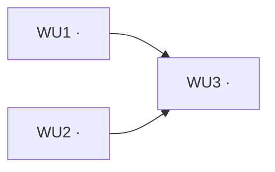

# chicio-labs-sdlc:sdlc — orchestrator

You (the main thread) run the interactive half of this pipeline yourself: Intake, Explore, the Human Gate, and the
PR. The automatable half, implementing and reviewing, runs as the saved dynamic workflow
**`chicio-labs-sdlc:workflow`** (`claude-plugins/chicio-labs-sdlc/workflows/workflow.js`), which builds the Approved Plan Wave
by Wave with Work Units in parallel. This skill instructs you to call the Workflow tool: invoking it is the user's
opt-in.

The vocabulary (Human Gate, Approved Plan, Work Unit, Work Unit Graph, Wave, Unit Checks, Full Checks, Unit Review,
Integration Review) is defined in `claude-plugins/GLOSSARY.md`; why the loop runs this way is
`claude-plugins/docs/adr/0001-parallel-work-units-in-a-workflow.md`. Use those terms in every prompt and report.

**Scope: CODE work only.** Content (MDX blog prose, DSA articles) is out of scope — see the Content firewall in
Intake.

**CodeGraph.** The repo is indexed by CodeGraph, and every code agent in the roster (explorer, implementer, reviewer,
bug-investigator) carries its own `codegraph_explore` access and codegraph-first instructions — do not re-explain the
tool in stage prompts. When **you** (the orchestrator) need a quick code fact between stages — scoping a slug,
sanity-checking a finding, sizing a change, drawing Work Unit boundaries — use `codegraph_explore` yourself instead of
a grep/read loop.

## Invocation

```
/chicio-labs-sdlc:sdlc [description] [--fix] [--in-place]
```

- `[description]` — what to build or fix (free text).
- `--fix` — select **fix mode**. Also implied if the user pastes a stack trace / error / failing-test output.
- `--in-place` — run in the **current** working tree instead of an isolated worktree. The pipeline is **isolated by
  default** (§ Isolation); pass this only when you deliberately want the live-tree flow.

Create a todo list with one item per stage of the selected mode, and work them in order. Do not skip a gate.

## Human gate (read before you start)

The pipeline has **exactly one** Human Gate: the brainstorm at Stage 2 in feature mode, or the confirm-root-cause at
Stage 2' in fix mode. That step is marked **[INTERACTIVE]** — keep all interaction inside it. The workflow cannot ask
anything: when it hits something only Fabrizio can decide, it stops and returns, and you bring the decision back to
him (§ Stage 4). That is a report, not a second gate.

Stage 5 opens the PR **automatically** once the workflow converges. The plan is where human judgement is
load-bearing; a pull request is already a reviewable, closable proposal. The pipeline never merges.

## Stage 0 — Intake (always)

1. **Parse** the description and flags. Decide mode: fix if `--fix` or a pasted trace/error is present, else feature.
2. **Content firewall.** If the task is purely content — adding/editing MDX blog posts, DSA articles, or prose — STOP
   and redirect: Posts and DSA course edits → `/chicio-blog-content:write-post`.
   This pipeline is for code. (A change that is *both* code and content stays here for the code part.)
3. **Isolation (default ON).** Unless `--in-place` was passed, `EnterWorktree` now — the whole pipeline runs in its
   own isolated worktree on its own `feat/<slug>` branch (the **pipeline worktree**). If the session is already inside
   a worktree, `EnterWorktree` refuses to nest: create one by hand off freshly fetched `origin/main` under
   `.claude/worktrees/` and enter it by path. Either way, run `npm install` in it before Stage 3.
4. **Branch guard.** In `--in-place` mode, run `git status`; if on `main`, create and switch to `feat/<slug>` (never
   commit to `main`). Slug from the description, refined after brainstorm.

## Feature mode

### Stage 1 — Explore
Dispatch **`chicio-labs-sdlc:explorer`** (sonnet, read-only) with the description. It returns the structured exploration
report (files by layer, reusable design-system surface, registration points, test surface, decisions to resolve).
Save it to a scratchpad file (`exploration.md`); it feeds Stage 2 and the workflow.

### Stage 2 — Brainstorm 🚪 **[INTERACTIVE] — THE HUMAN GATE**
Run **grill-with-docs** in the main thread, fed the exploration report + the description (+ any §9 "decisions to
resolve" the explorer surfaced). `grill-with-docs` is `disable-model-invocation`, so do what it does: invoke the
Skill tool twice, for **`grilling`** and **`domain-modeling`**. Interview the user until the approach is nailed and an
**Approved Plan** exists, while writing the glossary (`GLOSSARY.md`) and any ADRs (`docs/adr/`) as terms and decisions
settle.
- The repo has several contexts: read `GLOSSARY-MAP.md` first and write each term to the `GLOSSARY.md` of the context it
  belongs to, never to a root `GLOSSARY.md`. ADRs go in that context's `docs/adr/`, or in the root `docs/adr/` when the
  decision spans contexts.
- Load **both** skills. With only `grilling` loaded you get a good interview and no paper trail, which is the most
  reported failure of grill-with-docs, and it is known to drop the file writes when run as a step inside a pipeline
  like this one. Write each resolved term to `GLOSSARY.md` the moment it resolves, and check the working tree before
  closing the gate. A session with no new vocabulary and no ADR is legitimate: say so, don't invent entries.
- Everything decided that is neither a term nor an ADR lives only in the conversation, so it goes into the plan.

**The Work Unit Graph.** Before closing the gate, split the plan into Work Units and put the graph to Fabrizio as part
of the plan he approves:
- A Work Unit is a slice that can be implemented and tested on its own. Give each an id (`WU1`, …), a one-line title,
  the files it **owns** (globs), the Work Units it **depends on**, and whether it touches rendered UI, routes or
  flows.
- **Every file has exactly one owner.** Shared registration points (`lib/content/registry.ts`, barrel `index.ts`
  files, `package.json`, the lockfile, `turbo.json`) go to whichever Work Unit logically owns them; the others depend
  on it rather than editing it. Overlap is a planning error, and the gate is where it is caught.
- **At most 3 Work Units per Wave.** A bigger split means the plan should be two PRs.
- Most changes are a single Work Unit. Split only where parallel work genuinely exists; don't invent units.
- Show it as a Wave table in the terminal:

  ```
  Wave 1  WU1  registry entry + lib fn      owns apps/website/src/lib/content/**            deps —
          WU2  new design-system molecule   owns packages/matrix-design-system/src/molecules/x/**  deps —
  Wave 2  WU3  page wiring + e2e            owns apps/website/src/components/content/y/**, apps/website/src/app/y/**  deps WU1, WU2
  ```

- **Plan handoff:** always write the Approved Plan, Work Unit Graph included, to a scratchpad plan file (`plan.md`).
  The workflow and every agent read it from there, and a resume must see the same file.
- **Docs handoff:** if the session created or changed `GLOSSARY.md` or an ADR, commit them on the feature branch as a
  `docs:` commit before Stage 3, and pass their paths to the workflow (`docs`).
- **Do not proceed to Stage 3 until the user has approved the plan and its Work Unit Graph.**

### Stage 3 — Run the workflow
Call the Workflow tool with the saved workflow and the plan as `args` (an object, not a JSON string):

```
Workflow({
  name: "chicio-labs-sdlc:workflow",
  args: {
    mode: "feature" | "fix",
    slug: "<slug>",
    repoRoot: "<absolute path of the pipeline worktree>",
    featureBranch: "feat/<slug>",
    baseBranch: "main",
    planFile: "<scratchpad>/plan.md",
    explorationFile: "<scratchpad>/exploration.md",   // the root-cause report in fix mode
    docs: ["<glossary/ADR paths committed at the gate>"],
    units: [{ id: "WU1", title: "...", owns: ["..."], dependsOn: [], touchesUi: false }, ...]
  }
})
```

Keep the returned **run id** and **script path**: a resume needs both. What the workflow does, so you can explain it:

- It orders the Work Units into Waves. A **Wave of one** runs in the pipeline worktree. In a **Wave of two or three**,
  each implementer creates its own worktree (`.claude/worktrees/<slug>-<id>`, branch `wu/<slug>/<id>`, off the
  feature branch) and runs `npm install` in it; after the Wave a merge agent merges the converged branches into
  `feat/<slug>` and removes their worktrees.
- **Per Work Unit:** `chicio-labs-sdlc:implementer` builds it and passes the Unit Checks; `chicio-labs-sdlc:code-reviewer`
  runs the Unit Review; blocking findings loop back, **at most 2 rounds**. With a single Work Unit there is no separate
  Unit Review: the Integration Review is its review.
- **Integration**, once every Work Unit converged: `chicio-labs-sdlc:gate-runner` runs the Full Checks, then the
  Integration Review runs alongside `chicio-labs-sdlc:e2e-sentinel` (only when UI, routes or flows changed); a blocking
  sentinel finding counts like a review finding. One implementer fixes in the pipeline worktree, **at most 2 rounds**.
- **Rebuttals:** the implementer resolves every blocking finding by id as fixed or rebutted (once). The reviewer then
  withdraws or reasserts; a reasserted finding stops that Work Unit (or the integration) as `escalated`.
- **A stuck Work Unit** (escalated, exhausted, blocked on a file it does not own, or a merge conflict) does not stop
  the others: its dependents are skipped, and integration does not run.

### Stage 4 — Act on the result
The workflow returns `{ status, units: [{ id, status, rounds, commits, blocking, nonBlocking, ... }], integration }`.

- **`converged`** → Stage 5.
- **`partial`** (some Work Unit stuck; no integration ran) or **`escalated`** / **`exhausted`** (integration) → show
  Fabrizio each stuck item: the open blocking findings, the rebuttal and the reviewer's reasoning, or the blocker /
  conflict. For each, he decides:
  - **continue** — one more fix + review round, with his direction passed to the implementer;
  - **accept** — take the Work Unit (or integration) as it is, overriding the open findings;
  - **replan** — the Work Unit Graph was wrong (a missing owner, a conflict): fix `plan.md` and the `units`.

  Then resume: `Workflow({ scriptPath, resumeFromRunId, args })` with the same args plus
  `resolutions: { "<WU id>" | "integration": { action: "continue" | "accept", note: "<his words>" } }` (and the
  corrected plan for a replan). Every agent call whose prompt is unchanged replays from cache, so finished Work Units
  cost nothing again.
- **`environment`** → the Full Checks could not run for infrastructural reasons; report what the gate-runner said and
  re-run once it is fixed. **`blocked`** / **`failed`** → report and stop.

Never open a PR on anything but `converged`, unless Fabrizio explicitly says to.

### Stage 5 — Pull request (automatic, no gate)
1. Push the feature branch.
2. Open the PR with `gh pr create` to `main`, conventional-commit + Gitmoji title, using the PR template below, with
   the Work Unit Graph as a Mermaid diagram and one line per Work Unit.
3. Start a **non-blocking** CI watch (don't block the human on it).
4. Remove any `wu/` worktree the workflow left behind (`git worktree list`), then, unless `--in-place`,
   `ExitWorktree` (the pushed branch remains for review).

Then report to Fabrizio in one message: the PR URL, the outcome per Work Unit (rounds, blocking findings fixed), the
integration rounds and the Full Checks result, and every open non-blocking note. They read what shipped and intervene
on the PR itself if they disagree — that is what makes the missing gate safe.

**Never merge.** Opening a PR is reversible; merging is the human's call and is outside this pipeline.

## Fix mode (delta)

Stages 1–2 are replaced; Stages 3–5 are identical to feature mode, with `mode: "fix"`.

### Stage 1' — Investigate
Dispatch **`chicio-labs-sdlc:bug-investigator`** (opus) with the pasted stack trace / error + the description. It returns
a structured root-cause report (offending code, introducing commit, root cause, blast radius, fix direction + the
failing-test shape). It writes its findings to memory **regardless** of what happens next. Save the report to a
scratchpad file; it is the workflow's `explorationFile`.

### Stage 2' — Confirm root cause 🚪 **[INTERACTIVE] — THE HUMAN GATE**
Present the root-cause report, with **`domain-modeling`** loaded (Skill tool) for the discussion. Bugs regularly
expose a misunderstood concept, and some fixes encode a decision: write each term to the relevant `GLOSSARY.md` as it
resolves, offer an ADR only when all three of its criteria hold, and handle the docs exactly as Stage 2's docs handoff
does. A fix that surfaces no vocabulary writes nothing. The human decides:
- **Proceed** → the report becomes the Approved Plan, saved to `plan.md`, with a **single Work Unit** owning
  everything the fix touches. The implementer writes the failing test first, then the fix — strict red-green. A "fix"
  that genuinely needs several Work Units is a feature: rerun in feature mode.
- **Decline** → investigate-only. Stop the pipeline cleanly. (The investigator already persisted its memory, so the
  diagnosis is not lost.)

## Mechanical checks

- **Unit Checks** — run by the implementer for its Work Unit, trusted by the Unit Review: `npm run lint`,
  `npm run validate-architecture`, `npm run typecheck` (clean state: `rm -f next-env.d.ts`, `rm -rf .next`),
  `npm run test:run`.
- **Full Checks** — run once per integration round by `chicio-labs-sdlc:gate-runner`, on every Work Unit combined:
  the Unit Checks plus `npm run knip`, `npm run build`, and `npm run test:e2e` when UI, routes or flows changed. The
  Integration Review reads its verdict instead of re-running anything.

## Severity model

- **Blocking** (forces a loop round): correctness bug; architecture-boundary violation; missing/failing test or a
  vacuous test for changed behavior; security issue; UI/behavior mismatch vs the plan; broken/uncovered E2E flow; any
  check red; a Work Unit touching a file it does not own.
- **Non-blocking** (reported, never loops): style, naming, optional refactors, micro-optimizations.

## Isolation

- **Pipeline worktree (default):** `EnterWorktree` at Intake; the workflow, the gate-runner and the e2e-sentinel all
  run there; `ExitWorktree` at the end. It prevents collisions with other sessions and stray uncommitted changes.
- **Work Unit worktrees:** only for a Wave of two or three, created by the implementer itself off the feature branch
  (the Workflow tool's own `isolation: 'worktree'` branches off `main` and gives every fix round a fresh tree, so it is
  not used). Parallel implementers cannot share one tree: each wipes `.next`, needs port 3000, and commits on the same
  index.
- **`--in-place`:** the pipeline worktree is the current working tree. Use only when you're not running another
  session against the same clone.

## PR template

~~~bash
gh pr create --title "<type>(<scope>): :<gitmoji>: <short description>" --body "$(cat <<'EOF'
<short description>

## Description
<What was built/changed>

## Motivation and Context
<Why this change was needed>

## Work Units

- WU1 — <title>: <N> review round(s), <K> blocking fixed
- Integration: <N> round(s), Full Checks GREEN

## How Has This Been Tested?
Automated (lint, validate-architecture, knip, typecheck, Vitest, build; Playwright e2e when UI/flow) + browser.

## Types of changes
- [ ] Bug fix :bug: (non-breaking change which fixes an issue)
- [ ] New feature :sparkles: (non-breaking change which adds functionality)
- [ ] Breaking change :boom: (fix or feature that would cause existing functionality to change)

## Checklist:
- [X] My code follows the code style of this project :beers:.
- [X] My change requires a change to the documentation :bulb: and I have updated the documentation accordingly.
- [X] I have read the [CONTRIBUTING](https://github.com/chicio/chicio.github.io/blob/master/CONTRIBUTING.md) document :busts_in_silhouette:.
- [X] I have added tests to cover my changes :tada:.
- [X] All new and existing tests passed :white_check_mark:.
EOF
)"
~~~
Set the title prefix (`feat`/`fix`/`refactor`/…), the Gitmoji, and the checked "Types of changes" box to match the
change. For a single Work Unit, drop the Mermaid diagram and keep the one line.
