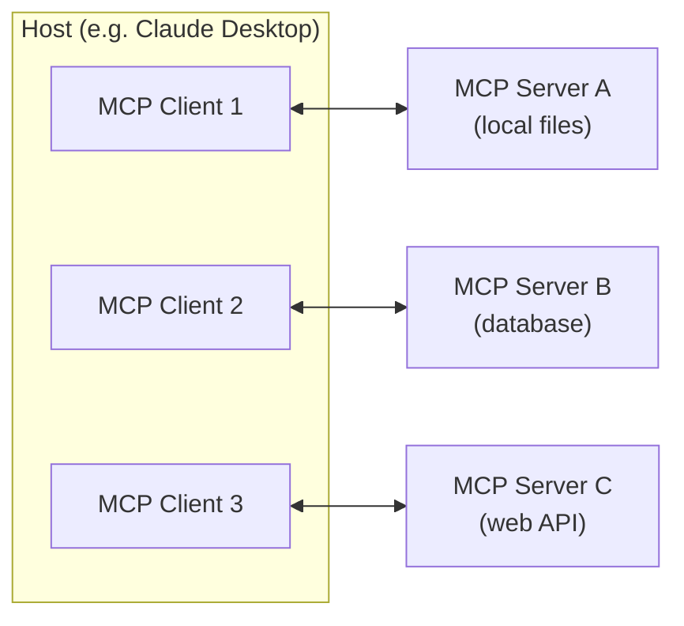
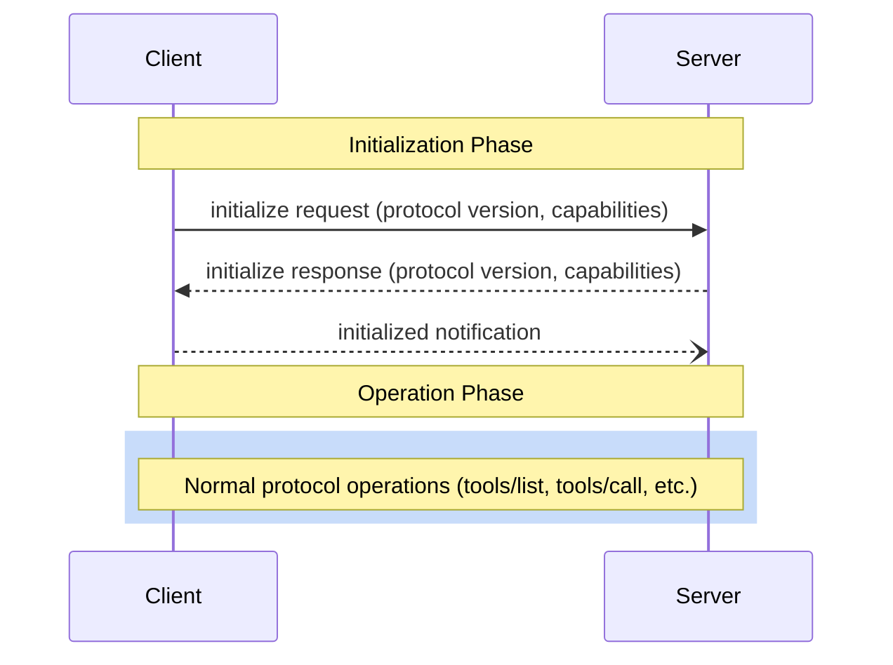

*How I built a Model Context Protocol (MCP) server on top of my Next.js blog, covering the MCP protocol architecture,
JSON-RPC transport, capability negotiation, Streamable HTTP, OAuth discovery, and a full TypeScript implementation
deployed on Vercel.*

---

At the end of my [previous article about guardrails for LLM chatbots](/blog/post/2026/04/26/llm-chatbot-guardrails),
I teased that the next step was building an MCP server for this blog.
Well, here we are.

If you've been following the AI tooling space, you've probably heard of the
[Model Context Protocol](https://modelcontextprotocol.io) (MCP).
It's an open standard created by Anthropic that lets AI assistants connect to external data sources and tools through
a unified interface.
Instead of copy-pasting content into a chat window, you give the AI a direct, structured connection to the source.
Pretty cool, right?

I wanted to understand how MCP actually works under the hood, not just use someone else's server.
The best way to learn a protocol is to implement it, so I decided to build one for this blog.
The result is a public MCP server that exposes 10 tools: AI assistants can search my blog posts, browse DSA exercises,
explore my videogame collection, and more, all through a standardized protocol that works with Claude Code, Claude
Desktop, VS Code, Cursor, and other MCP-compatible clients.

In this post, I'll first walk you through the MCP protocol itself (what it is, how it works, and why it matters),
and then show you how I implemented it on top of my Next.js blog using the official TypeScript SDK.
Let's start with the protocol.

## What is MCP?

The Model Context Protocol is an open standard that defines how AI applications communicate with external tools and
data sources.
Think of it as a USB-C port for AI: a universal connector that lets any compliant client talk to any compliant server,
regardless of who built either side.

The protocol takes inspiration from the
[Language Server Protocol](https://microsoft.github.io/language-server-protocol/) (LSP), which standardized how IDEs
communicate with language-specific tooling.
Just as LSP meant that a single language server could work with VS Code, Neovim, Emacs, and any other LSP client, MCP
means that a single tool server can work with Claude, Copilot, Cursor, and any other MCP client.
The key insight is the same: instead of building N x M integrations (every client with every server), you build N + M
(each client and each server implement the protocol once).

## The architecture: hosts, clients, and servers

MCP defines three roles in its architecture:

- **Hosts** are the LLM applications that users interact with directly (Claude Desktop, VS Code, Cursor, etc.). A host
manages one or more MCP clients.
- **Clients** are connectors within the host application. Each client maintains a 1:1 connection with a single MCP
server. The client handles protocol negotiation, message routing, and capability management.
- **Servers** are services that expose tools, resources, and prompts to the AI through the MCP protocol. A server can
be anything: a local process, a remote HTTP endpoint, a database connector, or (in my case) a Next.js API route.



This architecture means that a single host like Claude Desktop can connect to multiple MCP servers simultaneously,
each providing different capabilities.
One server might give the AI access to your local filesystem, another to your company's database, and a third to a
web API.
The host orchestrates all of this, and the AI model can use tools from any connected server as needed.

## JSON-RPC 2.0: the message format

Under the hood, MCP uses [JSON-RPC 2.0](https://www.jsonrpc.org/) as its message format.
Every message exchanged between client and server is a JSON-RPC message, which can be one of three types:

- **Requests**: messages that expect a response (identified by an `id` field and a `method`)
- **Responses**: replies to requests (matching the request's `id`, containing either a `result` or an `error`)
- **Notifications**: one-way messages that don't expect a response (have a `method` but no `id`)

For example, when a client wants to call a tool, it sends a JSON-RPC request like this:

```json
{
  "jsonrpc": "2.0",
  "id": 2,
  "method": "tools/call",
  "params": {
    "name": "search_content",
    "arguments": { "query": "React Native Skia" }
  }
}
```

And the server responds with:

```json
{
  "jsonrpc": "2.0",
  "id": 2,
  "result": {
    "content": [
      {
        "type": "text",
        "text": "[{\"slug\": \"/blog/2024/...\", \"title\": \"Custom shapes with React Native Skia\", ...}]"
      }
    ],
    "isError": false
  }
}
```

JSON-RPC gives MCP a clean, well-understood message format with built-in error handling and request/response
correlation.
It's a solid choice: simple enough to implement, expressive enough for bidirectional communication, and battle-tested
across many protocols.

## The three primitives: tools, resources, and prompts

MCP defines three types of capabilities (called "primitives") that servers can expose.
Each one has a different purpose and a different interaction model:

- **Tools** are functions that the AI model can call.
They're the most common primitive and the one I use in my implementation.
Tools are *model-controlled*: the LLM discovers available tools and decides when to invoke them based on the user's
query.
Each tool has a name, a description, and a JSON Schema that defines its input parameters.
The server executes the tool and returns the result.
Think of tools as API endpoints that the AI can call autonomously.

- **Resources** are data that the server makes available for context.
Unlike tools, resources are *application-controlled*: the host application (not the AI model) decides which resources
to include in the context.
Resources are identified by URIs and can contain text or binary data.
Think of resources as files or documents that the AI can read.

- **Prompts** are pre-defined message templates that the server provides.
Prompts are *user-controlled*: they're typically exposed through UI elements (like slash commands) and the user
explicitly selects which prompt to use.
Think of prompts as reusable conversation starters or workflows.

The distinction matters because it defines *who* decides when each primitive is used: the model (tools), the
application (resources), or the user (prompts).
For my blog's MCP server, tools are the perfect fit: I want AI assistants to autonomously discover and call functions
like `search_content` or `get_post` based on what the user is asking about.

## Lifecycle: capability negotiation

Before a client and server can exchange tools, resources, or prompts, they need to agree on what each side supports.
This happens during the *initialization phase*, which is the first interaction in any MCP session.

The flow works like this:

- The client sends an `initialize` request containing its supported protocol version, its capabilities, and
implementation information.
- The server responds with its own protocol version, capabilities, and info.
- The client sends an `initialized` notification to signal that it's ready for normal operations.



The capability negotiation is where the two sides declare what they support.
For example, a server that exposes tools will declare the `tools` capability in its response:

```json
{
  "capabilities": {
    "tools": {
      "listChanged": true
    }
  }
}
```

This tells the client "I have tools, and I'll notify you if the list changes."
Similarly, clients can declare capabilities like `roots` (filesystem access) or `sampling` (allowing the server to
request LLM completions).
Both sides must respect what was negotiated: a client shouldn't ask for resources if the server didn't declare the
`resources` capability.

## Transports: from SSE to Streamable HTTP

The MCP protocol is transport-agnostic (the JSON-RPC messages can flow over any communication channel), but the spec
defines two standard transports:

- **stdio**: the client launches the server as a subprocess and communicates via stdin/stdout.
This is the simplest transport and is perfect for local tools.
The client writes JSON-RPC messages to the server's stdin, and the server writes responses to stdout.
Messages are newline-delimited.

- **Streamable HTTP**: the server runs as an HTTP endpoint that the client connects to via POST and GET requests.
This is the transport for remote servers (like mine) and replaced the older HTTP+SSE transport from protocol version
2024-11-05.

Streamable HTTP is the interesting one for web deployments.
Here's how it works:

- The server exposes a single HTTP endpoint (e.g., `https://fabrizioduroni.it/api/mcp`) that accepts both POST and
GET requests.
- **POST** is used to send JSON-RPC messages from the client to the server. The server can respond with either a
single JSON response (`Content-Type: application/json`) or an SSE stream (`Content-Type: text/event-stream`) for
streaming results.
- **GET** is optional and allows the client to open a long-lived SSE stream for server-initiated messages (like
notifications).
- **DELETE** is used by the client to terminate a session.

The transport also supports *session management*: the server can assign a session ID during initialization (via an
`Mcp-Session-Id` header), and the client includes it in all subsequent requests.
This enables stateful interactions across multiple HTTP requests.

However (and this is important for serverless deployments), session management is optional.
A server can operate in *stateless mode* by not assigning a session ID, which means each request is handled
independently.
This is exactly what I do on Vercel, as I'll show you later.

The evolution from the old SSE transport to Streamable HTTP was a significant improvement.
The old transport required two separate endpoints (one for SSE streaming, one for POST requests), which was more
complex to implement and deploy.
Streamable HTTP consolidates everything into a single endpoint, supports both streaming and non-streaming responses,
and works naturally with serverless platforms.

## OAuth discovery: the `.well-known` endpoint

One aspect of MCP that surprised me during implementation is the OAuth discovery mechanism.
The MCP spec defines an authorization layer based on OAuth 2.1 that allows servers to require authentication.
When a client first connects to a server, it needs to figure out whether authentication is required and, if so, where
to find the OAuth endpoints.

The discovery works through a standard
[`.well-known/oauth-protected-resource`](https://datatracker.ietf.org/doc/html/rfc9728) endpoint (following RFC 9728).
Clients like `mcp-remote` (the stdio-to-HTTP bridge used by Claude Desktop) perform *proactive OAuth discovery*: before
even attempting to connect to the MCP endpoint, they hit this well-known URL to check whether the server requires
authentication.

For a public server like mine (no authentication required), this means I still need to respond to that discovery
request, or clients will fail.
The solution is to return a valid response with an empty `authorization_servers` array, signaling that the server is
public and no OAuth flow is needed.

I'll show you the implementation later, but I wanted to mention it here in the protocol section because it's a detail
that caught me off guard.
I deployed the MCP endpoint, everything worked in Claude Code (which uses Streamable HTTP natively), but Claude Desktop
(which uses `mcp-remote` as a bridge) kept failing with cryptic errors.
It took me a while to realize that `mcp-remote` was trying to discover OAuth endpoints before connecting, and failing
because I hadn't implemented the discovery response.

## Implementation: building the MCP server

Now that we understand the protocol, let's build the server.
My implementation uses the official [`@modelcontextprotocol/sdk`](https://github.com/modelcontextprotocol/typescript-sdk)
(v1.29.0) TypeScript SDK, which provides high-level abstractions over the raw JSON-RPC protocol.

### The server factory

The core of the implementation is a factory function that creates and configures the MCP server.
It instantiates an `McpServer` from the SDK and registers all 10 tools:

```typescript
import { McpServer } from "@modelcontextprotocol/sdk/server/mcp.js";
import { registerSearchContent } from "@/lib/mcp/tools/register-search-content";
import { registerListPosts } from "@/lib/mcp/tools/register-list-posts";
import { registerGetPost } from "@/lib/mcp/tools/register-get-post";
import { registerGetTags } from "@/lib/mcp/tools/register-get-tags";
import { registerGetDsaTopics } from "@/lib/mcp/tools/register-get-dsa-topics";
import { registerGetDsaExercises } from "@/lib/mcp/tools/register-get-dsa-exercises";
import { registerGetAboutMe } from "@/lib/mcp/tools/register-get-about-me";
import { registerGetSiteStats } from "@/lib/mcp/tools/register-get-site-stats";
import { registerGetVideogameConsoles } from "@/lib/mcp/tools/register-get-videogame-consoles";
import { registerGetVideogameGames } from "@/lib/mcp/tools/register-get-videogame-games";

export const createMcpServer = (): McpServer => {
    const server = new McpServer({
        name: "chicio-portfolio",
        version: "1.0.0",
    });

    registerSearchContent(server);
    registerListPosts(server);
    registerGetPost(server);
    registerGetTags(server);
    registerGetDsaTopics(server);
    registerGetDsaExercises(server);
    registerGetAboutMe(server);
    registerGetVideogameConsoles(server);
    registerGetVideogameGames(server);
    registerGetSiteStats(server);

    return server;
};
```

The `McpServer` class handles all the protocol details for you: capability negotiation, JSON-RPC message parsing,
tool listing, and tool invocation routing.
You just register your tools and the SDK takes care of the rest.

Each tool registration is isolated in its own module, which keeps things clean and makes it easy to add or remove
tools.
Let's look at a few examples.

### Tool implementation examples

The simplest tool is `get_tags`, which takes no parameters and returns all blog tags:

```typescript
import { McpServer } from "@modelcontextprotocol/sdk/server/mcp.js";
import { getTags } from "@/lib/content/posts";

export const registerGetTags = (server: McpServer): void => {
    server.registerTool(
        "get_tags",
        {
            title: "Get All Tags",
            description:
                "Returns all blog post tags with their post counts, sorted alphabetically. " +
                "Use a tag value with list_posts to filter posts by topic.",
        },
        async () => {
            const tags = getTags();

            const result = tags.map((tag) => ({
                tag: tag.tagValue,
                count: tag.count,
            }));

            return {
                content: [{ type: "text" as const, text: JSON.stringify(result, null, 2) }],
            };
        },
    );
};
```

The `registerTool` method takes three arguments: the tool name (used as the identifier in `tools/call` requests),
metadata (title, description, and optionally an input schema), and the handler function.
The description is important because it's what the AI model reads to understand when and how to use the tool.

A more interesting example is `search_content`, which accepts parameters defined via Zod schemas:

```typescript
import { McpServer } from "@modelcontextprotocol/sdk/server/mcp.js";
import z from "zod";
import { createSearchIndex } from "@/lib/content/search-index-factory";
import { getIndexableContent } from "@/lib/content/indexable-content";

export const registerSearchContent = (server: McpServer): void => {
    server.registerTool(
        "search_content",
        {
            title: "Search Portfolio Content",
            description:
                "Keyword search across all portfolio content: blog posts, DSA topics and exercises, about me. " +
                "Returns matching items with their slug, title, description, and tags.",
            inputSchema: {
                query: z.string().describe("Search query text"),
                limit: z
                    .number()
                    .optional()
                    .describe("Maximum number of results to return (default: 10, max: 30)"),
            },
        },
        async ({ query, limit }) => {
            const safeLimit = Math.min(limit ?? 10, 30);
            try {
                const index = createSearchIndex(getIndexableContent());

                const results = index.search(query, {
                    fields: {
                        title: { boost: 3 },
                        description: { boost: 2 },
                        tags: { boost: 1 },
                    },
                    expand: true,
                });

                const enriched = results.slice(0, safeLimit).map((result) => {
                    const doc = index.documentStore.getDoc(result.ref);
                    return {
                        slug: result.ref,
                        title: doc.title,
                        description: doc.description,
                        tags: doc.tags,
                        score: result.score,
                    };
                });

                return {
                    content: [{ type: "text" as const, text: JSON.stringify(enriched, null, 2) }],
                };
            } catch (error) {
                return {
                    content: [
                        {
                            type: "text" as const,
                            text: `Search failed: ${error instanceof Error ? error.message : String(error)}`,
                        },
                    ],
                    isError: true,
                };
            }
        },
    );
};
```

A few things worth noting here:

- **Zod for input validation**: The SDK uses Zod schemas to define and validate input parameters. The `.describe()`
calls provide hints that the AI model can use to understand what each parameter does.
The SDK automatically converts these Zod schemas into the JSON Schema format that the MCP protocol requires.
- **Reusing existing blog infrastructure**: The `search_content` tool reuses the same search index that powers the
blog's search feature (built with [elasticlunr](http://elasticlunr.com/)). The `list_posts` tool calls the same
`getPosts()` function that renders the blog listing page. This is a key advantage of building the MCP server into the
same codebase: you don't need to duplicate any logic.
- **Error handling with `isError`**: When something goes wrong, the handler returns `isError: true` in the result.
This follows the MCP convention of distinguishing between protocol errors (which use JSON-RPC error codes) and tool
execution errors (which are reported in the tool result).
The AI model can read the error message and decide how to proceed (maybe retry with different parameters, or tell the
user what went wrong).
- **All tools return JSON text**: Every tool serializes its result as a JSON string inside a `text` content block.
This is a straightforward approach that works well: the AI model can parse the JSON and extract whatever it needs.

The full list of 10 tools covers all the major content areas of the blog. You can see the complete tool list with
parameters and descriptions on the [MCP page](/mcp) of this site.

### The Next.js API route

The MCP server needs an HTTP endpoint to receive requests.
In Next.js App Router, this is a route handler at `src/app/api/mcp/route.ts`:

```typescript
import { createMcpServer } from "@/lib/mcp/server";
import { WebStandardStreamableHTTPServerTransport } from "@modelcontextprotocol/sdk/server/webStandardStreamableHttp.js";

const CORS_HEADERS: Record<string, string> = {
    "Access-Control-Allow-Origin": "*",
    "Access-Control-Allow-Methods": "GET, POST, DELETE, OPTIONS",
    "Access-Control-Allow-Headers": "Content-Type, Accept, MCP-Protocol-Version, Mcp-Session-Id",
};

const withCors = (response: Response): Response => {
    const headers = new Headers(response.headers);
    Object.entries(CORS_HEADERS).forEach(([key, value]) => headers.set(key, value));
    return new Response(response.body, {
        status: response.status,
        statusText: response.statusText,
        headers,
    });
};

const handleMcpRequest = async (req: Request): Promise<Response> => {
    const transport = new WebStandardStreamableHTTPServerTransport({
        sessionIdGenerator: undefined,
    });
    const server = createMcpServer();
    await server.connect(transport);
    const response = await transport.handleRequest(req);
    return withCors(response);
};

export async function GET(req: Request): Promise<Response> {
    return handleMcpRequest(req);
}

export async function POST(req: Request): Promise<Response> {
    return handleMcpRequest(req);
}

export async function DELETE(req: Request): Promise<Response> {
    return handleMcpRequest(req);
}

export async function OPTIONS(): Promise<Response> {
    return new Response(null, { status: 204, headers: CORS_HEADERS });
}
```

Let me walk you through the key design decisions:

- **`WebStandardStreamableHTTPServerTransport`**: The SDK provides this transport class specifically for environments
that use the Web Standard `Request`/`Response` API (which is what Next.js App Router uses). It handles all the
Streamable HTTP protocol details: parsing JSON-RPC messages from POST bodies, sending responses as either JSON or SSE
streams, and managing the protocol lifecycle.

- **`sessionIdGenerator: undefined`**: This is the crucial bit for serverless deployment. By setting the session ID
generator to `undefined`, we tell the transport to operate in *stateless mode*. No session ID is assigned during
initialization, so each request is handled independently. This is necessary on Vercel (and other serverless platforms)
because there's no guarantee that the same server instance will handle subsequent requests. The trade-off is that we
can't support server-initiated notifications or long-lived sessions, but for a read-only tool server, that's perfectly
fine.

- **Creating a new server per request**: Notice that `handleMcpRequest` creates a fresh `McpServer` and transport for
every incoming request. This might seem wasteful, but it's the correct pattern for stateless serverless execution.
Each request is self-contained: the server boots, handles the request, and is discarded. The MCP SDK is designed to
support this pattern.

- **CORS headers**: Since MCP clients can be browser-based (like the MCP Inspector or web-based AI assistants), the
endpoint needs proper CORS headers. I allow all origins (`*`) since this is a public, read-only server. The
`MCP-Protocol-Version` and `Mcp-Session-Id` headers are included in `Access-Control-Allow-Headers` because MCP
clients send them during protocol negotiation.

- **HTTP methods**: The route exports handlers for GET, POST, DELETE, and OPTIONS, matching the Streamable HTTP
transport requirements. GET is for SSE streams (server-to-client), POST is for client-to-server messages, DELETE is
for session termination, and OPTIONS handles CORS preflight.

### The OAuth discovery endpoint

As I mentioned earlier, MCP clients perform proactive OAuth discovery before connecting.
For a public server, we need to respond to the `.well-known/oauth-protected-resource` endpoint with metadata that
signals "no authentication required."

This is a separate Next.js route at `src/app/.well-known/oauth-protected-resource/route.ts`:

```typescript
import { MCP_SITE_URL } from "@/lib/mcp/config";

const CORS_HEADERS: Record<string, string> = {
    "Access-Control-Allow-Origin": "*",
    "Access-Control-Allow-Methods": "GET, OPTIONS",
    "Access-Control-Allow-Headers": "Content-Type",
};

export async function GET(): Promise<Response> {
    return Response.json(
        {
            resource: `MCP_SITE_URL`,
            authorization_servers: [],
        },
        { headers: CORS_HEADERS },
    );
}

export async function OPTIONS(): Promise<Response> {
    return new Response(null, { status: 204, headers: CORS_HEADERS });
}
```

The key is the `authorization_servers: []` field.
This follows [RFC 9728](https://datatracker.ietf.org/doc/html/rfc9728) (OAuth 2.0 Protected Resource Metadata) and
tells clients that this MCP server is a public resource with no authorization servers.
Clients like `mcp-remote` see the empty array and skip the entire OAuth flow, proceeding directly to the MCP
connection.

Without this endpoint, `mcp-remote` would try to discover OAuth endpoints, fail, and either error out or attempt a
full OAuth flow against non-existent authorization endpoints.
This was the issue I hit with Claude Desktop: the MCP endpoint itself was working fine, but `mcp-remote` (the bridge
that Claude Desktop uses for HTTP servers) was failing during the pre-connection OAuth discovery phase.

## Testing with different clients

Once the server was deployed, I tested it with several MCP-compatible clients.
Each one has a slightly different setup process, but they all connect to the same endpoint:
`https://fabrizioduroni.it/api/mcp`.

- **Claude Code** was the smoothest experience. It supports Streamable HTTP natively, so you just run
`claude mcp add --transport http fabrizioduroni.it https://fabrizioduroni.it/api/mcp` and you're connected.
No bridges, no extra dependencies.

- **VS Code with GitHub Copilot** (1.99+, agent mode) also worked well. You add the server to `.vscode/mcp.json`
with `"type": "http"` and the endpoint URL, and Copilot's agent mode can discover and call the tools.

- **Cursor** supports HTTP transport natively too. The configuration goes in `~/.cursor/mcp.json` with just the URL.

- **Claude Desktop** required `mcp-remote` as a stdio-to-HTTP bridge. This is where I hit the OAuth discovery issue
I described above. After implementing the `.well-known/oauth-protected-resource` endpoint, it worked, but I ran into
*another* issue: Claude Desktop couldn't find Node.js.
I use [`n`](https://github.com/tj/n) as my Node version manager, which installs Node in a non-standard path.
Claude Desktop launches `mcp-remote` via `npx`, but the desktop app doesn't inherit the shell's PATH, so it couldn't
find the `node` binary.
The fix was adding an `"env": { "PATH": "/usr/local/n/versions/node/22.14.0/bin:..." }` entry to the server config
in `claude_desktop_config.json`.
It's a small thing, but it took a while to debug because the error messages were not very helpful.

You can find detailed setup instructions for all these clients (and more) on the [MCP page](/mcp) of this site.

## Conclusion

Building an MCP server turned out to be a great way to understand the protocol from the inside out.
The MCP spec is well-designed: JSON-RPC 2.0 provides a clean message format, the three primitives (tools, resources,
prompts) cover different interaction patterns cleanly, and the Streamable HTTP transport works naturally with modern web
infrastructure.

The implementation itself was surprisingly straightforward thanks to the
[`@modelcontextprotocol/sdk`](https://github.com/modelcontextprotocol/typescript-sdk).
The SDK abstracts away all the protocol complexity (JSON-RPC parsing, capability negotiation, transport management) and
lets you focus on what matters: defining your tools and their logic.
The fact that I could reuse existing blog infrastructure (search index, content APIs, data access functions) meant that
most of the "hard work" was already done.

The trickiest parts were all at the edges: the OAuth discovery endpoint that I didn't know I needed, the PATH issues
with Claude Desktop and `n`, and understanding the stateless vs. stateful trade-offs for serverless deployment.
These are the kinds of things you only learn by actually implementing the protocol, which is exactly why I wrote this
article.

MCP is still young, but it's evolving quickly.
The transition from the old HTTP+SSE transport to Streamable HTTP in the 2025-03-26 spec version shows that the
protocol is actively being refined based on real-world usage.
I'm curious to see how the ecosystem grows, especially around resources and prompts (which I haven't implemented yet
but might explore in the future).

If you want to try the MCP server yourself, head over to the [MCP page](/mcp) for setup instructions, or just point
your favorite MCP client at `https://fabrizioduroni.it/api/mcp` and start exploring :heart:
