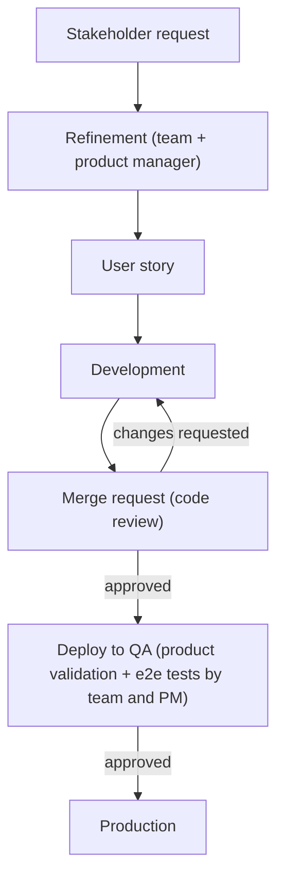
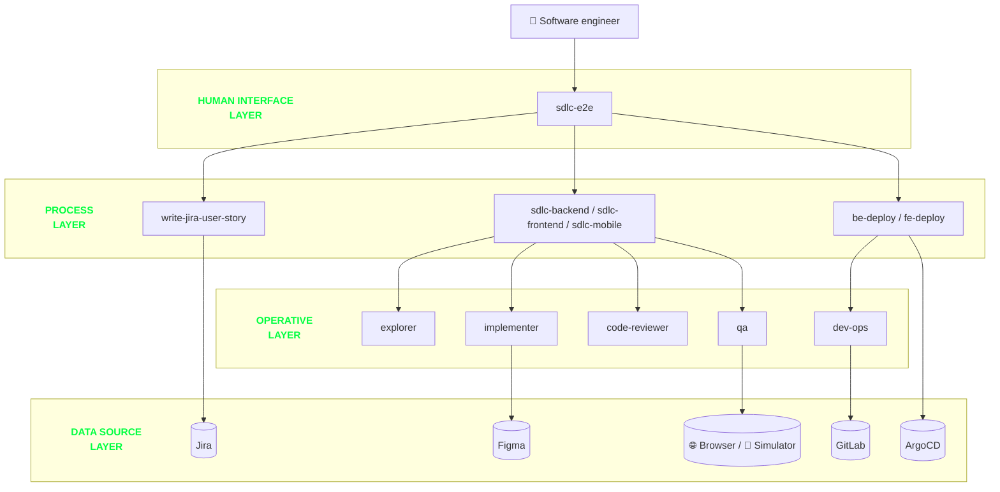

*In this post we will show how we encoded our software development lifecycle in a set of custom skills and subagents.*

---

Customer Value is a new area of lastminute.com, the company I work for (as you probably already know, if you have been following this blog for a while).
This area takes care of everything that happens after a user completes a booking: we own the personal area of our customers.
We let them check their bookings, do operations on them, and we generate new streams of value by offering ancillaries in the post-sale phase (baggage, automatic web check-in, seats, experiences, and more).
Customer Value is made of multiple teams, spanning both web and mobile.

Recently, together with two other colleagues from my area, we started to investigate how we could improve our Claude Code usage.
These colleagues are [Timothy Russo](/blog/author/timothy-russo), a mobile software engineer with more than 10 years of experience,
a broad knowledge of everything related to frontend (web and mobile), always up to date on the latest technologies and on the new tools coming out on the market,
and [Davide Botti](/blog/author/davide-botti), a senior software engineer specialized in backend with more than 10 years of experience,
focused on observability of applications, system design, and complex architectures.
Both of them are obsessed with product details and bringing value to the customers.

At lastminute.com we chose Anthropic and the Claude models as our standard AI platform, and Claude Code is the tool we use every day in our development workflow.
So at some point we started to think: "How can we encode our software development lifecycle in a Claude Code plugin, to leverage the capabilities of Claude Code at their best?".
There are basically two reasons behind this question:

- experiment with AI, the technology that is disrupting our field, going beyond the "chat with your codebase" usage and trying to understand what these tools can really do for us
- start to encode our own "software factory" in a set of custom skills and subagents: the way we are used to developing software, captured in a format that an AI agent can execute

In other words, we wanted to develop our own harness as a Claude Code plugin.

This project is an experiment. We are trying to understand how much we can push the automation of our workflows, and the tradeoff between automating something and the real benefit we get from it.
Not everything is worth automating: this is where real engineering (and real value for the company) shows up, because automation doesn't remove the need for software engineering: **it moves it**.
Someone still has to decide what is worth automating, review what the AI produces, and act as the human gate that keeps the quality bar where it should be.
We will show you later how these human gates are embedded directly in the flow of our plugin.
The same applies to writing good skills (as you will also see in this post): it has been (and still is) a try-and-learn journey: We learned from our mistakes and attempts, and we are still learning today.

## Claude Code, skills, and agents: a quick introduction

Before jumping into the plugin, let's quickly align on the building blocks we will talk about in the rest of this article.

[Claude Code](https://www.claude.com/product/claude-code) is the agentic coding tool from Anthropic.
It is a CLI where Claude can read your codebase, edit files, run commands, and drive an entire development workflow directly from the terminal.
In other words, Claude Code is itself a harness: the software shell around the model that runs the agentic loop, feeding it the right context, executing its tool calls, and looping until the job is done.
The model provides the intelligence, the harness turns it into a worker.
Keep this definition in mind, because it is the core idea of this article: if Claude Code is a harness around the model, our plugin is a harness around Claude Code, one that encodes how *we* develop software.

Claude Code offers some powerful extension points on top of this foundation. The two we used the most are agents and skills:

- an [agent](https://code.claude.com/docs/en/sub-agents) is WHO does the work: an isolated worker with its own context window, its own list of allowed tools, its own model, and its own persona.
  It receives a task, decides autonomously how to reach the goal (it is not a fixed script), and the caller only sees its final message.
- a [skill](https://code.claude.com/docs/en/skills) is HOW to do a task: on-demand procedural knowledge (a `SKILL.md` file, plus optional scripts and resources) that gets loaded into the context of whoever invokes it.
  It does not create a new context, and it does not have its own model or tools: it is knowledge, not a worker.

If you want a simple mental model: skills are the standard operating procedures of a company, while agents are the specialized employees that execute them.
A [plugin](https://code.claude.com/docs/en/plugins) is the way to package skills and agents together, so they can be versioned and distributed as a single unit (in our case, through an internal marketplace).

This is all you need to know to follow the rest of the article. Let's now look at the workflow we wanted to encode.

## Our workflow

Before describing the plugin, it is worth showing the current state of our way of working, because that is exactly what we tried to encode.
Our teams follow SCRUM, and what matters for this article is the journey a feature makes from an idea to production.

Everything starts with a request coming from our stakeholders.
The product manager brings the request to our refinement sessions, sometimes with a user story already sketched, sometimes not.
During the refinement, the team analyzes the request together with the product manager, and the output is a user story ready to be developed.
After the refinement, the team takes the story and develops it.
The development produces a merge request (MR, the GitLab equivalent of a GitHub pull request) that is shared with the other developers for code review and validation.
After the approval, the new feature is deployed to our QA environment for product validation: the team, together with the product manager, tests end-to-end that everything works correctly.
After this last approval, the feature finally goes to production.



If you look carefully at this flow, you will notice that it is full of human checkpoints: the refinement discussion, the code review on the merge request, and the final product validation in QA.
Keep them in mind: when we encoded this workflow in our plugin, these checkpoints became the human gates we mentioned in the introduction.

## Our Claude Code plugin

We tried to encode in skills and agents the way of working described in the previous section: not a generic coding assistant, but our own process, phase by phase.

### Writing the user story

The first step is writing the Jira user story, encoded in a skill called `write-jira-user-story`.
Every skill starts with a frontmatter block that tells Claude Code when to trigger it. This is the (redacted) one of our skill:

```markdown
---
name: write-jira-user-story
description: Use when the user asks to write, create, or open a Jira work item (or several) — user story,
technical task, or bug — for our project in the company Jira. Triggers include "create a story",
"open a ticket", "add a tech task", "log a bug", "write me a Jira for X".
---
```

The skill enforces the layout our team uses for every work item. The description of a story is made of three mandatory sections:

```markdown
## Acceptance criteria

**AC1 — <short title>**

**Given** <precondition>
**When** <action / trigger>
**Then** <expected outcome>

## TECH TODO

**in <service / repo>**

* <task>
    * <sub-task or detail>

## VALIDATION

<concrete steps to verify the change in the real system>
```

Among these, probably the most relevant section is the **TECH TODO**.
Here we try to be as precise as possible with respect to the actual code structure: we list the **services, repositories, or UI components to touch**, and what changes in each of them.
In this way we guide the next phase, pointing the LLM already in the right direction in terms of design and implementation of the feature.
A story written in this way is important not only for our workflow integration: it also acts as **documentation of the feature**, so we can consult it later if we need to understand why the code contains some specific logic.

The skill also encodes the small pieces of discipline that make the difference in day-to-day usage:

- the **input** does not need to be a clean spec: the skill can mine a pasted **Slack conversation** or a **meeting transcript**, separating the actual ask from the side chatter
- if the **TECH TODO** would come out empty or vague, the skill does not accept a "TBD" placeholder: it starts a `grilling` session with the user until the list is implementation-ready
- before creating anything, it **checks whether the story already exists**, to avoid duplicates in the backlog. This is a consequence of the fact that sometimes our product manager comes with a story that is a sort of placeholder
 for later discussions and technical implementations. In these cases, the skill pick the already existing story and enriches with the tech details.

The `grilling` skill mentioned above deserves a proper introduction, because we will meet it again later.
It is a community skill coming from the [Matt Pocock skills repository](https://github.com/mattpocock/skills), and it does exactly what the name suggests: it grills you :fire:.
The LLM interviews you relentlessly about a plan or a design, asking one question after another, challenging your assumptions, until every open decision is resolved.
The output is a plan with no ambiguity left: exactly what you want before handing the work over to an AI agent.

The skill uses the [Atlassian plugin](https://claude.com/plugins/atlassian) to interact with our boards, and it creates the story directly in the backlog, under the epic chosen by the user, with him as reporter, in a proper status, ready to be moved automatically by the next skills.

### Implementing the user story: the SDLC skills

The second step is the implementation of the story. For this we have three skills, one for each tech stack we work with in our area:

- `sdlc-backend`, for our Spring Boot microservices (Kotlin-first), built on top of [AppFw](https://technology.lastminute.com/frontend-backend-languages-frameworks/), our internal abstraction over Spring Boot
- `sdlc-frontend`, for our React + TypeScript web frontends
- `sdlc-mobile`, for our React Native mobile app

Each skill has its own peculiarities related to the tech stack.
For example, `sdlc-backend` knows how to navigate a Maven reactor and how to deal with our internal framework, while `sdlc-mobile` is focused on React Native and its ecosystem.
But even with these differences, they all share the same structure: the skill acts as an **orchestrator** of the software development lifecycle.
It runs in the main conversation, keeps the overall state of the process, and delegates the operations of each phase to specialized subagents.

This is the (slightly trimmed) frontmatter of `sdlc-frontend`; the other two share the same shape:

```markdown
---
name: sdlc-frontend
description: "Orchestrates a self-correcting software-development-lifecycle pipeline for a frontend
project (React + TypeScript). Feature development only: explore → brainstorm → implement ⇄ review → MR.
Architecture-agnostic — discovers each project's layout from CLAUDE.md, .claude/rules, and package.json
rather than assuming one. Dispatches the specialized fe-* agents from the main thread with human gates
at plan approval and MR."
argument-hint: "<JIRA-KEY> [figma-url] [extra context] [--isolated] [--qa|--no-qa]"
effort: high
allowed-tools:
  - Agent
  - Skill
  - <file reading and search tools>
  - <the shell commands the pipeline needs (git, glab, npm, ...)>
  - <the MCP tools of the required plugins (atlassian, figma)>
---
```

There are three interesting things in this frontmatter, beyond the trigger description we already saw:

- the `argument-hint` declares the parameters the skill accepts
- the `allowed-tools` section is a **whitelist**: the orchestrator can dispatch agents, invoke other skills, and run only the commands it needs (`git`, `glab`, `npm`). Everything else is off-limits.
  When you let an LLM drive your software development lifecycle, constraining what it can touch is not a detail
- `effort: high` raises the reasoning effort of the model while this skill runs: orchestration decisions are worth the extra thinking tokens

Let's look closer at the shared parameters, each one changing the behavior of the pipeline:

- `<jira-ticket>`: the user story to develop. The skill fetches it from Jira and moves it automatically to "In Progress". Remember the effort we put in the **TECH TODO** section? This is where it pays off: the skill extracts it from the story and uses it as the primary seed of the planning phase
- `<figma-url>`: the URL of the mockup to implement. This parameter is accepted only by the skills with a UI to build (`sdlc-frontend` and `sdlc-mobile`), and it drives the UI fidelity across planning, implementation, and review
- `--isolated`: runs the whole pipeline in an isolated [git worktree](https://git-scm.com/docs/git-worktree). This lets us trigger multiple workflows in parallel on the same codebase
- `--qa` / `--no-qa`: forces or skips the runtime validation phase (more on this later)

Before starting the real work, every skill runs the same intake ritual.
It refuses to work on the default branch, creating a feature branch named after the ticket.
It builds a manifest of the project context files (`CLAUDE.md`, `ARCHITECTURE.md`, the [Claude Code rules](https://code.claude.com/docs/en/memory#organize-rules-with-claude%2Frules%2F) in `.claude/rules`) that will be passed to every dispatched agent.
Only then does the pipeline start. Let's see the workflow the skills share, phase by phase.

### The workflow of the SDLC skills

Every pipeline goes through the same phases: explore, plan (with a human gate), implement and review (in a loop), runtime validation, and merge request (with the second human gate).
Let's walk through them one by one.

#### Explore

The first phase is the exploration of the codebase.
An ad hoc `explorer` agent (one variant for each of the three tech stacks: `fe-explorer`, `be-explorer`, `mobile-explorer`) explores the project to understand where and how the feature should be developed.
Like the skills, the agents are also defined by a markdown file with a [dedicated frontmatter](https://code.claude.com/docs/en/sub-agents). This is the one for `fe-explorer`:

```markdown
---
name: fe-explorer
description: Read-only explorer for a frontend project (React + TypeScript). Discovers the project's
ACTUAL architecture (it does not assume one) from CLAUDE.md, .claude/rules, and package.json, then
produces a structured report. Use as the first stage of a feature investigation, before brainstorming
or implementation. Does NOT write code, run builds, or make changes.
model: haiku
color: cyan
tools:
  - Read
  - Grep
  - Glob
---
```

Three properties are worth a comment:

- `model: haiku`: exploration is about coverage, not deep reasoning, so this agent runs on a cheap and fast model. The cheap agent maps the territory so that the expensive ones don't burn tokens rediscovering the structure of the codebase
- `tools`: the whitelist strikes again, and this time it makes the agent **read-only**. With only `Read`, `Grep`, and `Glob` available, the explorer physically cannot write files or run commands
- `color`: a cosmetic one, but handy in day-to-day usage. Each agent gets its own color in the terminal output, so you can spot at a glance which agent is running while the orchestrator works

To optimize the exploration, we put some guidance in place based on `CLAUDE.md`, the [Claude Code rules](https://code.claude.com/docs/en/memory#organize-rules-with-claude%2Frules%2F), and a custom `ARCHITECTURE.md` file:
the explorer treats them as sources of truth, instead of re-deriving the structure of the project at every run.
When it finishes, the agent reports back to the orchestrator with a report in a precise format:

```markdown
## Exploration Report

### Scope
- Ticket and area(s) touched

### Discovered architecture
- Structural units and their roles, layering and import conventions

### Relevant files
- <file — role>

### Patterns to follow
- <pattern> — see <file:line> (concrete example)

### Build & test commands
- Build, tests (full and scoped), test stack

### Integration points
- APIs, state stores, routing, feature toggles

### Risks & unknowns
- Ambiguities and open decisions

```

This format is not a stylistic choice: it is the **contract** between the agent and the orchestrator.
Structured reports are what make the communication between agents reliable: the orchestrator knows exactly what to expect, and each downstream phase knows where to find what it needs.

#### Brainstorm and plan: the first human gate

After the exploration, the planning phase starts, and here we meet the `grilling` skill again.
The orchestrator seeds it with the exploration report, the **TECH TODO** section of the story, and, if provided, the Figma design of the feature.
Then the interview starts: the orchestrator grills us until every doubt about the development is clarified.
The result is a plan that must be explicitly approved before any code gets written: this is the **first human gate** of the pipeline.
For UI work, the plan also captures the QA scenarios that will drive the runtime validation phase later.

One important design decision: this phase is not delegated to a subagent. It runs in the main conversation, driven by the orchestrator itself.
In this way, all the information that emerges during the brainstorming stays in the context window, available to guide the next phases.

#### Implement

When the plan gets approved, the orchestrator dispatches a new subagent: the `implementer`.
Like the explorer, it comes in three tech-stack variants, each one knowing how to write code in its own ecosystem.
This agent does the "real" work: it implements the feature following the approved plan, writing both the production code and its tests.

The implementer works leveraging one of our team's ways of working, **micro commits**:
every logical step of the implementation becomes a small, self-contained commit.
In this way, even if the final merge request results in a big amount of changes, we are still able to navigate the implementation commit by commit, checking what the LLM produced and whether it matches our expectations. Note that this is one of many points in the workflow where our experience as engineers is paramaount: best practices now matter more than ever if we want to produce a well engineered (and so, maintainable) code.

The implementer runs on `sonnet`, a mid-tier model, and this is a **deliberate choice**.
Why not the most powerful model available? Because **the hard thinking already happened**: the plan was written in the main conversation by the more powerful model driving the orchestrator (Opus, in our case).
The implementer does not have to design anything: it executes a well-defined plan. **A cheaper model guided by a good plan is more efficient**, and it is faster too.

Before declaring its work done, the implementer must run the **mechanical gates** of the project: the full test suite and the production build must pass.
Then it reports back to the orchestrator with a structured completion report:

```markdown
## Completion Report

### What was implemented
- <behavior delivered>

### Files touched
- <grouped created / modified / deleted>

### Commits
- <the micro-commit sequence (hashes + subjects)>

### Verification results
- <pass/fail per check (test, build)>

### Architecture decisions
- <judgment calls where the plan or the rules were silent, which neighbor patterns were matched>

### Skipped or unverified
- <anything intentionally not done>
```

#### Review

After the implementation, the orchestrator dispatches the `code-reviewer` agent, and the **implement ⇄ review loop** starts.
The reviewer is the critic of the pipeline: it does not write code. It reviews the diff against the approved plan and the project conventions, and it classifies every finding by severity: **blocking** or **non-blocking**.

Its first rule is the one we like the most: **do not trust, re-run**.
The implementer claims the tests and the build are green? The reviewer re-runs them itself before looking at a single line of the diff.
Then it returns its verdict to the orchestrator, again in a precise format:

```markdown
## Review Verdict: APPROVED | CHANGES_REQUESTED

### Gates (re-run)
- test / build: <pass|fail each>

### Blocking findings
- [<category>] <file:line> — <what's wrong, why it blocks, how to fix>

### Non-blocking findings
- <file:line> — <suggestion>

### UI fidelity (if applicable)
- <match | mismatch: details>

### Summary
- <one line>
```

The reviewer runs on the most powerful model available (Opus, in our case): judging code requires more depth than executing a plan.
As a nice side effect, the loop gets **model diversity**: the code written by one model is judged by a different one, **reducing the risk of an agent rubber-stamping** its own blind spots.

The implement ⇄ review loop is bounded to a **maximum of 3 rounds**:

- if the verdict is `APPROVED`, the loop ends immediately (the other rounds are simply skipped)
- if the verdict is `CHANGES_REQUESTED`, the blocking findings go back to the implementer, which either fixes them (with new micro commits) or rebuts once with a technical justification.
  On a rebuttal, the reviewer either withdraws the finding or re-asserts it: a re-asserted finding does not loop again, it escalates directly to the human
- non-blocking findings never loop: they are just reported at the end
- **after 3 rounds with unresolved blocking findings, the pipeline stops and surfaces them to the software engineer**

The bounded loop is another place where the "automation moves the engineering" idea shows up: the agents correct each other, but the disagreements always land on a human desk, never in an infinite loop.

#### Runtime validation: the QA agents

After the review loop converges, the pipelines branch.
For `sdlc-backend`, the workflow moves directly to the merge request phase.
The two skills with a UI to validate (`sdlc-frontend` and `sdlc-mobile`) add a **runtime validation** phase instead.
The idea behind it: for UI work, reviewing the diff is not enough. Someone has to actually run the app and use the feature, like a QA engineer would do. So we encoded that too:

- `fe-qa` drives a real Chromium browser through the [`agent-browser` CLI (by Vercel Labs)](https://agent-browser.dev)
- `mobile-qa` drives the iOS simulator or the Android emulator through the [`agent-device` CLI (by Callstack)](https://github.com/callstackincubator/agent-device)

These are community tools that let an LLM interact with a running app: open screens, click and tap, fill forms, inspect the UI tree, and take screenshots.

The validation follows a dedicated sub-workflow.
The QA agent derives a **test book** of test cases, starting from the QA scenarios captured in the plan and the changes of the current branch compared to main.
Then it launches the app, exercises the test cases one by one, and captures a screenshot for each of them, together with logs and console evidence.
Everything is compiled into a Markdown QA report with a final verdict: `PASS`, `FAIL`, or `NOT PERFORMED`.

The verdict drives what happens next:

- `PASS`: the evidence is carried forward to the merge request gate
- `FAIL`: the findings go back to the implementer for a fix, followed by a quick re-review and a single re-run of the QA. If it still fails, the pipeline stops and surfaces the evidence to the human
- `NOT PERFORMED` (no simulator available, build failed, no dev server): recorded as a non-blocking note, without blocking the pipeline

This phase is conditional: it runs when a user-visible surface changes; it can be forced with `--qa`, and it can be skipped with `--no-qa` (or automatically, when the change has no rendered surface).
When the merge request is opened, the QA report and its screenshots are published as a comment on it, so the human reviewers see the evidence next to the diff.
To be honest with you, at the moment this last part is fully implemented only in the mobile pipeline: `sdlc-frontend` carries the QA evidence to the merge request gate, but it does not post the comment yet (it is on our todo list :sweat_smile:).

#### The merge request: the second human gate

At this point the development is done. But the orchestrator does not open the merge request on its own: it shows us the full diff summary, the final review verdict, the non-blocking findings, and the QA evidence, and then it waits.
Opening the MR requires explicit approval: this is the **second human gate** of the pipeline.

On approval, the orchestrator pushes the branch and opens the merge request on our GitLab using the [`glab` CLI](https://gitlab.com/gitlab-org/cli), with a specific format for the title and the description.
The title follows the conventional commit format `<type>(<KEY>): <ticket summary>`, where the type is mapped from the Jira issue type (a story becomes `feat`, a bug becomes `fix`, and so on).
The description contains the summary of the change, the reference to the Jira story, and the notes coming from the review.
As a final touch, the skill proposes to transition the Jira story to "In Review" with a comment containing the MR URL, and it kicks off a non-blocking watch of the CI pipeline.

The pipeline ends here, with the merge request open. **Merging remains a human act**: the last word on what lands on the main branch is still ours.
From this point, the standard flow we described at the beginning of the article takes over: our teammates review the merge request like any other, and their review could end up requiring changes to the code.
After all the automation needed to make a story ready for production, the human touch comes back exactly where it matters the most: deciding, together, that the code is good enough to reach our users.

### sdlc-e2e: one skill to rule them all

All the skills above are invocable manually on a specific project.
But we tried something more ambitious: a single skill, `sdlc-e2e`, that orchestrates all of them.
It accepts generic requests in natural language, like `write a jira with this content: <description of the task>` or `implement this jira ticket: <ticket-id>`, and it routes them to the right skill. This choice makes the entire approach modular, allowing us to change specific part of the process addressing only the interested sub skill (write jira skill or sdlc-fe).

This skill impersonates a **senior end-to-end engineer** wearing three hats at once:

- a product owner, who cares that a work item captures real user and business value
- a scrum master, who keeps the work well-formed, correctly scoped, and unblocked
- a senior engineer, who can take a story all the way to working, tested, and verified code

The most interesting part is the **routing**. When we ask it to implement a story, `sdlc-e2e` has to decide which pipeline to use, and it does it by reading the project names listed in the **TECH TODO** section of the story (that section keeps paying off).
Each project is classified by naming convention: the mobile app repository routes to `sdlc-mobile`, a project with the UI suffix we use for web frontends routes to `sdlc-frontend`, and everything else routes to `sdlc-backend`.
If the TECH TODO names no projects, the skill does not guess the stack: it asks.
And if a story spans more than one stack (a backend service plus its frontend, for example), the pipelines run sequentially, backend first: the frontend usually depends on the backend contract.

The skill also connects the phases of our workflow into a single conversation.
After creating a story, it always offers to implement it right away.
And after an implementation ends with an approved merge request, it can carry on with the **deployment**.
For a backend service, once we approve the merge (another human gate), the skill dispatches a `be-dev-ops` agent that watches the GitLab CI pipeline, and then hands off to a dedicated `be-deploy` skill that monitors the rollout on ArgoCD (in the end, just an abstraction over our K8s cluster), QA environment first, then production.
Under the hood, `be-deploy` uses the [MCP server for ArgoCD](https://github.com/argoproj-labs/mcp-for-argocd), falling back to the [`argocd` CLI](https://argo-cd.readthedocs.io/en/stable/cli_installation/) when the MCP tools are not available.
Frontend services have their own deployment flow, encoded in a separate `fe-deploy` skill that watches the pipeline and drives a human-gated production release.

## The plugin architecture: a pyramid of skills

After this long and, we hope, interesting journey, it's time to put all the pieces together. Below you can find the full overview of the plugin architecture, in terms of interactions between skills and agents.



As you can see, the solution we came up with is organized in **layers of abstraction**.
At the top, there are the skills that interact directly with the human: their only purpose is to translate a request expressed in natural language into a more technical one (`sdlc-e2e` is the perfect example).
This boundary is not rigid, though: the process skills can also be invoked directly.
It happens all the time in our day-to-day work, because the story is often written in a different moment than its execution: in that case we skip the top of the pyramid and trigger the right SDLC skill for the operation we need.
In the middle, the skills become more specific and technically aware: the SDLC pipelines know our development process, the deploy skills know our release flow.
At the bottom, there are the agents: the operative layer aware of the actual technology, like Kotlin, and that interact with MCP servers or make direct API calls

- the implementer that, guided by the approved plan, writes the actual Kotlin or TypeScript code
- the dev-ops agent that checks the GitLab CI status
- the QA agents that drive a real browser or a real simulator

Below everything, the data source layer: the external systems that feed our processes with their raw material (stories from Jira, designs from Figma, pipelines from GitLab, rollout states from ArgoCD, running apps to validate).
They are the sources our agents read from, and at the same time the targets they act on.

Notice also the shape: one skill at the top, a handful of skills in the middle, fifteen agents at the bottom.
The higher the layer, the closer to the human language; the lower the layer, the closer to the machine.
This design mimics engineering structures we already know well:

- the test pyramid, with few expensive tests at the top and many cheap ones at the bottom
- the OSI network stack, where each layer talks only to its adjacent layers, speaking a well-defined protocol
- a compiler pipeline, where a high-level language is progressively lowered until it becomes machine code
- the divide et impera of procedural programming, and the way dynamic programming decomposes a big problem into smaller subproblems
- the layered architectures of Object Oriented Programming

And this is exactly where the title of this post comes from: we ended up with a **pyramid of skills**, where every layer translates the language of the layer above into the language of the layer below, from human intent at the top, down to the code that reaches our users.

## Improvements

The plugin is far from perfect, and in a way we like it like that: every rough edge we hit in our daily usage becomes the next thing to encode.
These are the improvements already on our list:

- **speed**: the pipeline takes time, especially in the implement ⇄ review loop. We are evaluating possible solutions, like parallelizing independent tasks of the implementation
- **micro commits**: sometimes the implementer pushes the micro-commit approach too far, producing commits smaller than a meaningful logical step. We are still thinking about how to tune it
- **validation**: we would like to push the runtime validation phase further, generating also a video of the QA session that we could review, instead of screenshots only
- **QA evidence parity**: as we anticipated, `sdlc-frontend` must catch up with `sdlc-mobile` on publishing the QA report and its screenshots as a comment on the merge request
- **Token consumption**: even if the pipelines doesn't consume a lot of token, we want to optimize more each step, not only just by choosing the right model for every subagent. 

## Conclusion and next steps

The plugin is still in an experimental phase. We are testing it in our daily job, tweaking it as soon as we find problems and bugs :sweat_smile:.
Up to now, the results have been pretty good and quite impressive :rocket:.
Given a request from our product manager, we were able to completely automate the workflow for specific tasks, while we focused on the harder, more "human" work: system design, product discovery, code review of other features, deep manual validation of the product.

One honest note to close.
A tool like this reduced our time to market for new features, and we noticed it in our day-to-day work. But at the moment we don't have a specific metric to demonstrate the effectiveness of the plugin.
We also don't believe that measuring the number of deploys is a relevant metric to assess the goodness of an AI tool (see, for example, [the metrics recently shared by Spotify](https://www.youtube.com/watch?v=9DHZLw5653E)).
Understanding the real impact of this harness is one of the next steps of the experiment.

On the tooling side, we already have two new experiments on our radar.
The first one is [dynamic workflows](https://code.claude.com/docs/en/workflows), the Claude Code feature that orchestrates subagents at scale through scripts.
We want to understand where this kind of orchestration fits next to the deterministic pipelines of our skills, starting from the parallelizable phases of the workflow.
The second one is the integration of [Claude Design](https://claude.ai/design) into `sdlc-frontend`: we are defining our design system and our user flows there, so connecting it to the pipeline that builds our frontend feels like a natural evolution.

Stay tuned: we will share the next evolutions of our pyramid in a future article :wave:.

