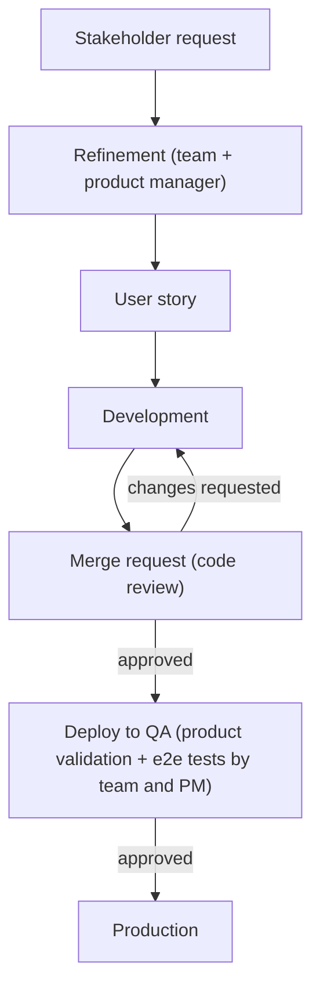

*In this post we will show how we encoded our software development lifecycle in a set of custom skills and subagents.*

---

Customer Value is a new area of lastminute.com, the company I work for (as you probably already know, if you have been following this blog for a while).
This area takes care of everything that happens after a user completes a booking: we own the personal area of our customers.
We let them check their bookings, do operations on them, and we generate new streams of value by offering ancillaries in the post-sale phase (baggage, automatic web check-in, seats, experiences, and more).
Customer Value is made of multiple teams, spanning both web and mobile.

Recently, together with two other colleagues from my area, we started to investigate how we could improve our Claude Code usage.
These colleagues are [Timothy Russo](/blog/author/timothy-russo), an experienced mobile software engineer with more than 10 years of experience,
a broad knowledge of everything related to frontend (web and mobile), always up to date on the latest technologies and on the new tools coming out on the market,
and [Davide Botti](/blog/author/davide-botti), a senior software engineer specialized in backend with more than 10 years of experience,
focused on observability of applications, system design, and complex architectures.
Both of them are obsessed with product details and bringing value to the customers.

At lastminute.com we chose Anthropic and the Claude models as our standard AI platform, and Claude Code is the tool we use every day in our development workflow.
So at some point we started to think: "How can we encode our software development lifecycle in a Claude Code plugin, to leverage the capabilities of Claude Code at their best?".
The reasons behind this question are basically two:

- experiment with AI, the technology that is disrupting our field, going beyond the "chat with your codebase" usage and trying to understand what these tools can really do for us
- starting to encode our own "software factory" in a set of custom skills and subagents: the way we are used to developing software, captured in a format that an AI agent can execute

In other words, we wanted to develop our own harness as a Claude Code plugin.

This project is an experiment. We are trying to understand how much we can push the automation of our workflows, and the tradeoff between automating something and the real benefit we get from it.
Not everything is worth automating: this is where real engineering (and real value for the company) shows up.
Automation doesn't remove the need for software engineering: it moves it.
Someone still has to decide what is worth automating, review what the AI produces, and act as the human gate that keeps the quality bar where it should be.
We will show you later how these human gates are embedded directly in the flow of our plugin.
The same applies to writing good skills (as you will see also today in this post): it has been (and still is) a try-and-learn journey.
We learned from our mistakes and attempts, and we are still learning today.

## Claude Code, skills, and agents: a quick introduction

Before jumping into the plugin, let's quickly align on the building blocks we will talk about in the rest of this article.

[Claude Code](https://www.claude.com/product/claude-code) is the agentic coding tool from Anthropic.
It is a CLI where Claude can read your codebase, edit files, run commands, and drive an entire development workflow directly from the terminal.
In other words, Claude Code is itself a harness: the software shell around the model that runs the agentic loop, feeding it the right context, executing its tool calls, and looping until the job is done.
The model provides the intelligence, the harness turns it into a worker.
Keep this definition in mind, because it is the core idea of this article: if Claude Code is a harness around the model, our plugin is a harness around Claude Code, one that encodes how *we* develop software.

Claude Code offers some powerful extension points on top of this foundation. The two we used the most are agents and skills:

- an [agent](https://code.claude.com/docs/en/sub-agents) is WHO does the work: an isolated worker with its own context window, its own list of allowed tools, its own model, and its own persona. It receives a task, decides autonomously how to reach the goal (it is not a fixed script), and the caller only sees its final message.
- a [skill](https://code.claude.com/docs/en/skills) is HOW to do a task: on-demand procedural knowledge (a `SKILL.md` file, plus optional scripts and resources) that gets loaded into the context of whoever invokes it. It does not create a new context, and it does not have its own model or tools: it is knowledge, not a worker.

If you want a simple mental model: skills are the standard operating procedures of a company, while agents are the specialized employees that execute them.
A [plugin](https://code.claude.com/docs/en/plugins) is the way to package skills and agents together, so they can be versioned and distributed as a single unit (in our case, through an internal marketplace).

This is all you need to know to follow the rest of the article. Let's now look at the workflow we wanted to encode.

## Our workflow

Before describing the plugin, it is worth showing the state of the art of our way of working, because that is exactly what we tried to encode.
Our teams follow SCRUM, and what matters for this article is the journey a feature makes from an idea to production.

Everything starts with a request coming from our stakeholders.
The product manager brings the request to our refinement sessions, sometimes with a user story already sketched, sometimes not.
During the refinement, the team analyzes the request together with the product manager, and the output is a user story ready to be developed.
After the refinement, the team takes the story and develops it.
The development produces a merge request (MR, the GitLab equivalent of a GitHub pull request) that is shared with the other developers for code review and validation.
After the approval, the new feature is deployed in our QA environment for the product validation: the team, together with the product manager, tests end to end that everything works correctly.
After this last approval, the feature finally goes to production.



If you look carefully at this flow, you will notice that it is full of human checkpoints: the refinement discussion, the code review on the merge request, and the final product validation in QA.
Keep them in mind: when we encoded this workflow in our plugin, these checkpoints became the human gates we mentioned in the introduction.

## Our Claude Code plugin

We tried to encode in skills and agents the way of working described in the previous section: not a generic coding assistant, but our own process, phase by phase.

### Writing the user story

The first step is the writing of the Jira user story, encoded in a skill called `write-jira-user-story`.
Every skill starts with a frontmatter that tells Claude Code when to trigger it. This is the (redacted) one of our skill:

```markdown
---
name: write-jira-user-story
description: Use when the user asks to write, create, or open a Jira work item (or several) — user story,
technical task, or bug — for our project in the company Jira. Triggers include "create a story",
"open a ticket", "add a tech task", "log a bug", "write me a Jira for X".
---
```

The skill enforces the layout our team uses for every work item. The description of a story is made of three mandatory sections:

```markdown
## Acceptance criteria

**AC1 — <short title>**

**Given** <precondition>
**When** <action / trigger>
**Then** <expected outcome>

## TECH TODO

**in <service / repo>**

* <task>
    * <sub-task or detail>

## VALIDATION

<concrete steps to verify the change in the real system>
```

Among these, probably the most relevant section is the **TECH TODO**.
Here we try to be as precise as possible with respect to the actual code structure: we list the **services, repositories, or UI components to touch**, and what changes in each of them.
In this way we guide the next phase, pointing the LLM already in the right direction in terms of design and implementation of the feature.
A story written in this way is important not only for our workflow integration: it also acts as **documentation of the feature**, so we can consult it later if we need to understand why the code contains some specific logic.

The skill also encodes the small pieces of discipline that make the difference in the day-by-day usage:

- the **input** does not need to be a clean spec: the skill can mine a pasted **Slack conversation** or a **meeting transcript**, separating the actual ask from the side chatter
- if the **TECH TODO** would come out empty or vague, the skill does not accept a "TBD" placeholder: it starts a `grilling` session with the user until the list is implementation-ready
- before creating anything, it **checks whether the story already exists**, to avoid duplicates in the backlog

The `grilling` skill mentioned above deserves a proper introduction, because we will meet it again later.
It is a community skill coming from the [Matt Pocock skills repository](https://github.com/mattpocock/skills), and it does exactly what the name suggests: it grills you.
The LLM interviews you relentlessly about a plan or a design, asking one question after another, challenging your assumptions, until every open decision is resolved.
The output is a plan with no ambiguity left: exactly what you want before handing the work over to an AI agent.

The skill uses the [Atlassian plugin](https://claude.com/plugins/atlassian) to interact with our boards, and it creates the story directly in the backlog, under the epic chosen by the user.

### Implementing the user story: the SDLC skills

The second step is the implementation of the story. For this we have three skills, one for each tech stack we work with in our area:

- `sdlc-backend`, for our Spring Boot microservices (Kotlin-first), built on top of [AppFw](https://technology.lastminute.com/frontend-backend-languages-frameworks/), our internal abstraction over Spring Boot
- `sdlc-frontend`, for our React + TypeScript web frontends
- `sdlc-mobile`, for our React Native mobile app

Each skill has its own peculiarities related to the tech stack.
For example, `sdlc-backend` knows how to navigate a Maven reactor and how to deal with our internal framework, while `sdlc-mobile` is focused on React Native and its ecosystem.
But even with these differences, they all share the same structure: the skill acts as an **orchestrator** of the software development lifecycle.
It runs in the main conversation, keeps the overall state of the process, and delegates the operations of each phase to specialized subagents.

This is the (slightly trimmed) frontmatter of `sdlc-frontend`; the other two share the same shape:

```markdown
---
name: sdlc-frontend
description: "Orchestrates a self-correcting software-development-lifecycle pipeline for a frontend
project (React + TypeScript). Feature development only: explore → brainstorm → implement ⇄ review → MR.
Architecture-agnostic — discovers each project's layout from CLAUDE.md, .claude/rules, and package.json
rather than assuming one. Dispatches the specialized fe-* agents from the main thread with human gates
at plan approval and MR."
argument-hint: "<JIRA-KEY> [figma-url] [extra context] [--isolated] [--qa|--no-qa]"
effort: high
allowed-tools:
  - Agent
  - Skill
  - <file reading and search tools>
  - <the shell commands the pipeline needs (git, glab, npm, ...)>
  - <the MCP tools of the required plugins (atlassian, figma)>
---
```

There are three interesting things in this frontmatter, beyond the trigger description we already saw:

- the `argument-hint` declares the parameters the skill accepts
- the `allowed-tools` section is a **whitelist**: the orchestrator can dispatch agents, invoke other skills, and run only the commands it needs (`git`, `glab`, `npm`). Everything else is off-limits. When you let an LLM drive your software development lifecycle, constraining what it can touch is not a detail
- `effort: high` raises the reasoning effort of the model while this skill runs: orchestration decisions are worth the extra thinking tokens

Let's look closer at the shared parameters, each one changing the behavior of the pipeline:

- `<jira-ticket>`: the user story to develop. The skill fetches it from Jira and moves it automatically to "In Progress". Remember the effort we put in the **TECH TODO** section? This is where it pays off: the skill extracts it from the story and uses it as the primary seed of the planning phase
- `<figma-url>`: the URL of the mockup to implement. This parameter is accepted only by the skills with a UI to build (`sdlc-frontend` and `sdlc-mobile`), and it drives the UI fidelity across planning, implementation, and review
- `--isolated`: runs the whole pipeline in an isolated [git worktree](https://git-scm.com/docs/git-worktree). This lets us trigger multiple workflows in parallel on the same codebase
- `--qa` / `--no-qa`: forces or skips the runtime validation phase (more on this later)

Before starting the real work, every skill runs the same intake ritual.
It refuses to work on the default branch, creating a feature branch named after the ticket.
It builds a manifest of the project context files (`CLAUDE.md`, `ARCHITECTURE.md`, the [Claude Code rules](https://code.claude.com/docs/en/memory#organize-rules-with-claude%2Frules%2F) in `.claude/rules`) that will be passed to every dispatched agent.
Only then the pipeline starts. Let's see the workflow the skills share, phase by phase.

### The workflow of the skills

Every pipeline goes through the same phases: explore, plan (with a human gate), implement and review (in a loop), runtime validation, and merge request (with the second human gate).
Let's walk through them one by one.

#### Explore

The first phase is the exploration of the codebase.
An ad hoc `explorer` agent (one variant for each of the three tech stacks: `fe-explorer`, `be-explorer`, `mobile-explorer`) explores the project to understand where and how the feature should be developed.
Like the skills, also the agents are defined by a markdown file with a [dedicated frontmatter](https://code.claude.com/docs/en/sub-agents). This is the one of `fe-explorer`:

```markdown
---
name: fe-explorer
description: Read-only explorer for a frontend project (React + TypeScript). Discovers the project's
ACTUAL architecture (it does not assume one) from CLAUDE.md, .claude/rules, and package.json, then
produces a structured report. Use as the first stage of a feature investigation, before brainstorming
or implementation. Does NOT write code, run builds, or make changes.
model: haiku
color: cyan
tools:
  - Read
  - Grep
  - Glob
---
```

Three properties are worth a comment:

- `model: haiku`: exploration is about coverage, not deep reasoning, so this agent runs on a cheap and fast model. The cheap agent maps the territory so that the expensive ones don't burn tokens rediscovering the structure of the codebase
- `tools`: the whitelist strikes again, and this time it makes the agent **read-only**. With only `Read`, `Grep`, and `Glob` available, the explorer physically cannot write files or run commands
- `color`: a cosmetic one, but handy in the day-by-day usage. Each agent gets its own color in the terminal output, so you can spot at a glance which agent is running while the orchestrator works

To optimize the exploration, we put in place some indications based on `CLAUDE.md`, the [Claude Code rules](https://code.claude.com/docs/en/memory#organize-rules-with-claude%2Frules%2F), and a custom `ARCHITECTURE.md` file: the explorer treats them as sources of truth, instead of re-deriving the structure of the project at every run.
When it finishes, the agent reports back to the orchestrator with a report in a precise format:

```markdown
## Exploration Report

### Scope
- Ticket and area(s) touched

### Discovered architecture
- Structural units and their roles, layering and import conventions

### Relevant files
- <file — role>

### Patterns to follow
- <pattern> — see <file:line> (concrete example)

### Build & test commands
- Build, tests (full and scoped), test stack

### Integration points
- APIs, state stores, routing, feature toggles

### Risks & unknowns
- Ambiguities and open decisions

```

This format is not a stylistic choice: it is the **contract** between the agent and the orchestrator.
Structured reports are what make the communication between agents reliable: the orchestrator knows exactly what to expect, and each downstream phase knows where to find what it needs.

#### Brainstorm and plan: the first human gate

After the exploration, the planning phase starts, and here we meet the `grilling` skill again.
The orchestrator seeds it with the exploration report, the **TECH TODO** section of the story and, if provided, the Figma design of the feature.
Then the interview starts: the orchestrator grills us until every doubt about the development is clarified.
The result is a plan that must be explicitly approved before any code gets written: this is the **first human gate** of the pipeline.
For UI work, the plan also captures the QA scenarios that will drive the runtime validation phase later.

One important design decision: this phase is not delegated to a subagent. It runs in the main conversation, driven by the orchestrator itself.
In this way, all the information that emerges during the brainstorming stays in the context window, available to guide the next phases.

When the plan gets approved, a new subagent is trigged. This agent is called `implementer`. Like for the explorer, also the this one has knowledge about the specific tech stack of the project we are working on.
This agent does the "real" work: it implements the feature based on the plan defined before. Like for the other agent, also this one reports back to the main orchestrator the result of the implementation in a specific format

```
ADD format of the report of the implementer subagents
```

This agent works leveragin one of our ways of working: micro commit. In this way, even if the PR results in a big amount of changes (eg. > 50), we are still able to navigate commit by commit the implementation to check what the LLM produced and if it matches our expecation.
This agent uses `sonnet` as model, defined in the frontmatter of the agent. Why? Because the plan was already writter by the main orchestrator, leveragin a much powerful model (eg. Opus). In this way the implementer saves token guided by the plan defined.

After implementation, we trigger another agent from the orchestrator: the `code-reviewer`. The orchesrator starts a 3 rounds of code review. The new agent review the implementation done, and reports back to the orchestrator the result of the review, also in terms of `APPROVED/CHANGES_REQUESTED`, and in case of the latter one also the list of changes to be done.

```
ADD format of the report of the code reviewer subagents
```

If the first round of code review is already successful, we skip obviously the other 2 rounds. If all the three rounds of code review fail, the decision about what to do is delegate back to the orchestrator in the main conversion (and obviously to the software engineer).

After this point, there is a branch between the skills related to frontend technologies, and the one for BE. The backend one, opens the PR, after the approval/local review of the software engineer. The frontend skills instead, use ad-hoc tools to do a local validation of the feature implemented. The web fe one uses [`agent-browser`](XXX link), while the mobile one uses [`agent-device`](XXX link). These are tools from the community that let the LLMs interact respectively with the iOS simulator/Android emulator and the browser. This step is optional, and can be skipped if we launch the skill with the `--no-qa`. (TODO: add for mobile version the generation of the screenshot with the report of the validation).
In both FE workflow we defined a sub workflow to do this validation, based on a test book of test cases defined by the llm from the modification done in the current branch with respect to the main one. A series of screenshot is taken, and composed in a markdown report. Both the markdown and the screenshots are published in a comment on the final merge request when the software engineer tells to the orchestrator to publish it.

At this point the workflow is completed and the PR is published on our gitlab leveraging the [`glab` gitlab cli](XXX link), using a specific format for the title and the description.

### sdlc-e2e

All these skills above are invocable manually on a specific project. Anyway we tried something more ambitious: we create a specific skill to orchestrate all of them, capable of accepting a generic user command like `write jira with this content <description of the task>`, or `implement this jira ticket: <ticket id>`. This skill will select, in case of implementation, the right skill for the tech stack of the project you are into. 
It will also be able, for the backend tech stack, to deploy the result of the code to our microservice leveraging another skill called `be-deploy`, that uses under the hood the [argo mcp](XXX Link) (falling back to [`argocli`](XXX LINK) when not available) to monitor the progress of the deploy.

## Plugin Architecture overview

Below you can find a full overview of the architecture of the plugin, in terms of interaction between skills and agents. This is a recap of the full plugin architecture.
As you can see, we came up with a solution that includes different layers of abstractions: at the upper levels there are skills that interact directly with a human input, and the only purpose is to translate what they receive in a more technical language (see the e2e skill). At the middle levels, skills are more specific and has a more techincal knowledge (see the sdlc-mobile, be and fe). At the lowest levels, there are agents that are the operative layer that interact with the specific technology (see the implementer that, guided by the plan done before by the explorer, writes the actual Kotlin/Typescript code, or the dev-ops that checks Gitlab CI status using Gitlab APIs). This is a design approach that mymics other engineering structures we find in software engineering (think about the test pyramid, or the divide et impera approach of the procedural programming and what we are used to see in the Object Oriented Programming).

XXX Mermaid graph of the plugin architecture

## Improvements

The plugin is far from perfect. We already noted some possible improvements:

- speed. The plugin takes more time in terms of execution, especially in the implementer vs code reviewer phase. We are thinking about possible solution like trying to parallelize tasks implementation.
- micro commit approach. Sometimes the implementer agent tends to push to much the micro commit approach. We are still thinking about possible solutions to improve this.
- validation. We would like to push more the validation phase, to generate also video of the QA phase that could be reviewed by us.

## Conclusion and next step

The plugin is still in an experimental phase. We are testing it in our daily job, tweaking it as soon as we find out problems and bugs.
In our opinion, up to now the results were pretty good and quite impressive. We were able, giving a request from our product manager, to completely automatize the workflow for specific tasks while we were focusing on much more harder and "human related" work: system design, product discovery, code review of other features, manual deep validation of the product.  
One think we would like to say, is that for sure, a tool like this, reduced our time to market for releasing new features, and we noticed it in our day by, but unfortunately, at the moment we don't have a specific metric to demonstrated the effectiveness of this plugin.  
Also because, related for example to the metrics recently shared by Spotify, we don't belive that measuring the number of deploy if a relevant metric for assessing the goodness of the AI tools.  
We will try to understand in a next phase how to understand the real impact. 
Stay tuned for the next evolution we will share with you in other article.

